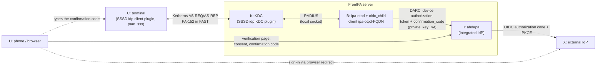
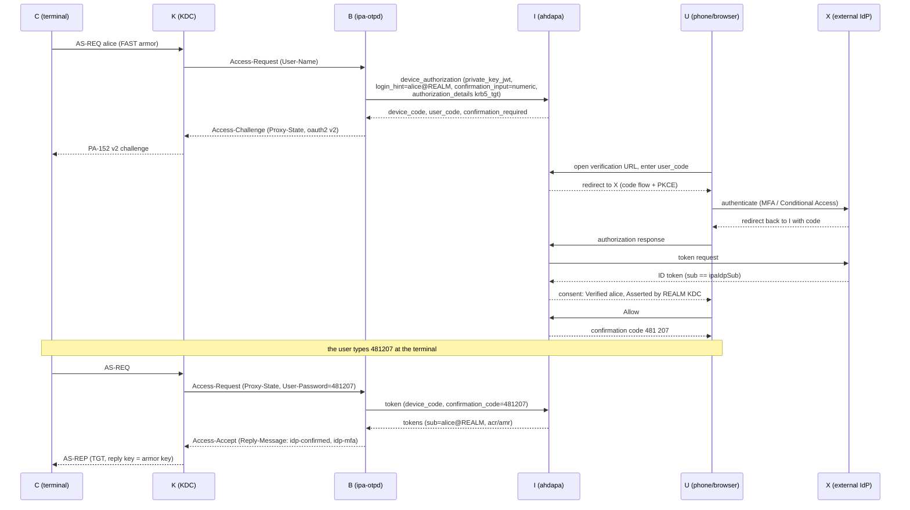

# DARC for Kerberos IdP pre-authentication

## Overview

Kerberos pre-authentication against an external identity provider
(PA-152, `PA-REDHAT-IDP-OAUTH2`) uses the OAuth 2.0 Device Authorization
Grant (RFC 8628): the terminal shows a URL and a code, the user signs in on
a phone or another computer and approves, and the KDC issues a TGT.

That flow is open to *consent phishing*. An attacker performs anonymous
PKINIT, requests a TGT for `victim@REALM`, receives the victim's code in
their own FAST channel, and lures the victim to the genuine sign-in page.
The victim signs in (with MFA) and approves. The subject check passes
because the attacker asked for exactly the victim's principal, and the TGT
is encrypted to the attacker's armor key.

DARC — Device Authorization with Return Confirmation — closes this. After
the user approves, the page shows a short confirmation code that must be
typed at the terminal. The code travels back inside the FAST-protected
second AS-REQ and is checked by the IdP. An attacker's terminal never sees
the page, so it never gets a TGT unless the victim reads the code back to
the attacker, which the page tells them never to do.

The protocol is described in full in the DARC proposal; this page covers
the FreeIPA implementation (phase 1).

## Architecture

* **I — Ahdapa** is the DARC authorization server. It renders the
  verification and consent pages, applies the hint lock, shows the
  confirmation code, checks it at the token endpoint and relays the
  upstream `acr`/`amr`/`auth_time` in its ID token. It federates the user's
  sign-in to X with the authorization code flow; **X never runs the device
  grant**, so an Entra ID tenant can block the device code flow entirely.
* **B — ipa-otpd** on each KDC host is a confidential client of I,
  `ipa-otpd-<fqdn>`, authenticated with `private_key_jwt`. The key is
  created by the installer in `/var/lib/ipa/ipa-otpd/ahdapa-client.p12`
  (password in `ahdapa-client.pwd`, both root-only) and registered inline in
  Ahdapa's static clients file. One client per host lets I tell KDC hosts
  apart.
* **K — the SSSD `idp` KDC plugin** carries the code from PA-152 into RADIUS
  `User-Password` and adds the indicators B returns.
* **C — the SSSD `idp` client plugin, `krb5_child` and `pam_sss`** prompt
  for the code and send it.

The verification URI is Ahdapa's issuer on the server that started the
flow (`https://<server>/idp/device`), so the browser, B's polls and the
session all meet on one server without a shared session store.

## Kerberos sequence

## Wire contract

| Leg | Message |
|-----|---------|
| B → I device authorization | `confirmation_input=numeric`, `login_hint=<uid>@<REALM>`, `authorization_details=[{"type":"krb5_tgt","realm":…,"principal":…,"armor":"anonymous"}]` |
| I → B | RFC 8628 fields + `confirmation_required`, `confirmation_code_length`, `confirmation_code_charset` |
| K → C PA-152 challenge | `oauth2 {"v":2,"delivery":"page","verification_uri":…,"user_code":…,"confirmation":{"length":6,"charset":"numeric"},"expires_in":…}` |
| C → K second AS-REQ | PA-152 = `oauth2-confirm <code>` (version 1 clients: empty) |
| K → B | Access-Request with `Proxy-State` (device code state) and `User-Password` (the code) |
| B → I token request | `device_code` grant + `confirmation_code` |
| B → K Access-Accept | `Reply-Message` = `oauth2 {"v":2,"indicators":["idp-confirmed",…]}` |

I's token endpoint answers `confirmation_required` (approved, no code),
`invalid_confirmation` (wrong code, attempts left), `access_denied`
(attempts exhausted, denied, reported, or another account tried a hinted
request) and `expired_token`; B answers each with Access-Reject.

**Fails closed.** A version 1 client ignores `v` and `confirmation` and
sends an empty PA-152. B then has no code, I never issues a token, and the
login fails. Enforcement is on the server; old client plugins cannot
weaken it.

## Verification page

The consent page labels what it shows by its source:

* *Verified: signing in as alice@EXAMPLE.COM* — the hint lock matched the
  signed-in user. Another account entering the code cancels the request.
* *Asserted by EXAMPLE.COM KDC (kdc1.example.com): Kerberos sign-in to
  EXAMPLE.COM as alice@EXAMPLE.COM from an unidentified terminal (anonymous
  armor)* — the `krb5_tgt` detail. Only clients whose
  `authorization_details_types` list `krb5_tgt` (the `ipa-otpd-*` clients)
  may send it, and a rule limits it to the realm.

After *Allow*, the page shows the code with the warning never to share it,
and an *I didn't start this — cancel and report* button.

## Indicators

`ipa-otpd` returns, and the KDC plugin adds (only `idp-*` names are
accepted from RADIUS):

| Indicator | When |
|-----------|------|
| `idp` | always (configured on the principal as today) |
| `idp-confirmed` | the DARC confirmation code was verified |
| `idp-mfa` | the upstream `amr` contains `mfa`, `otp`, `hwk` or `sc` |
| `idp-phr` | the upstream `amr` contains `hwk`, or `acr` is `phr`/`phrh` |

Services that must not accept unconfirmed IdP tickets require
`idp-confirmed` through `krbprincipalauthind`.

## Throttling

The principal in an AS-REQ is not authenticated: with anonymous PKINIT
anyone can start an IdP login for any user. A limit keyed on the
principal would therefore let a stranger lock that user out, and
cancelling a pending flow when a new one starts would let a stranger
cancel the user's sign-in. Neither is done. Starting a flow has no effect
the user sees (there is no push; the code needs the approver), so the
remaining concern is volume:

* Ahdapa counts requests per source address (`auth_rate_limit`, raised to
  300 per 5 minutes in the FreeIPA template because every IdP login of a
  KDC host comes from that host), and sees one client per KDC host.
* Per-terminal limits need the client address, which the KDC does not
  expose to preauth plugins yet (phase 2).
* Delivery modes that notify the user at initiation (CIBA push) must not be
  enabled without per-terminal limits and host armor.

## Configuration and rollout

`/etc/ipa/default.conf`, `[global]`:

| Option | Meaning |
|--------|---------|
| `ahdapa_issuer_url` | Route Kerberos IdP logins through Ahdapa (set on new installations). |
| `ahdapa_darc_confirmation` | `required` (default): no TGT without the code. `off`: this host's `ipa-otpd` client runs plain RFC 8628 (listed in Ahdapa's `confirmation_exempt_clients`); Ahdapa still mediates the flow and X still never sees the device grant. |

New installations get `required`. `ipa-server-upgrade` on a server that
already routes through Ahdapa writes `off` if the option is absent, so that
Kerberos clients without DARC support keep working; set it to `required`
and run `ipa-server-upgrade` once all clients run SSSD with DARC support.

## Upgrade and backup

The ipa-otpd key is created once and kept across upgrades; it lives under
`/var/lib/ipa`, which `ipa-backup` already includes. `ipa-server-install
--uninstall` removes it.

## Not in this phase

* **Phase 2 — identified terminals.** MIT krb5 does not expose the armor
  ticket's client principal or the request's source address to kdcpreauth
  plugins. With two new callbacks the `krb5_tgt` detail can name the host
  (`armor: host`, `client_host`, `client_addr`), `idp-host` can be issued,
  and a policy can require host-keytab armor for IdP logins.
* **Reachability of Ahdapa from phones** (relay, IdP application proxy,
  CIBA delivery to an authenticator app).
* **Per-IdP-reference policy** in LDAP and an `ipa` command to manage it.
* **Approval notices** to the user; Ahdapa currently records
  `device.approved`, `device.reported`, `device.confirmation-failed`,
  `device.confirmation-exhausted` and `device.approved-unconfirmed` audit
  events.
* Ahdapa does not evaluate its HBAC rules on device approvals; the hint
  lock and the per-client `krb5_tgt` ceiling are what restrict the
  `ipa-otpd` clients today.
