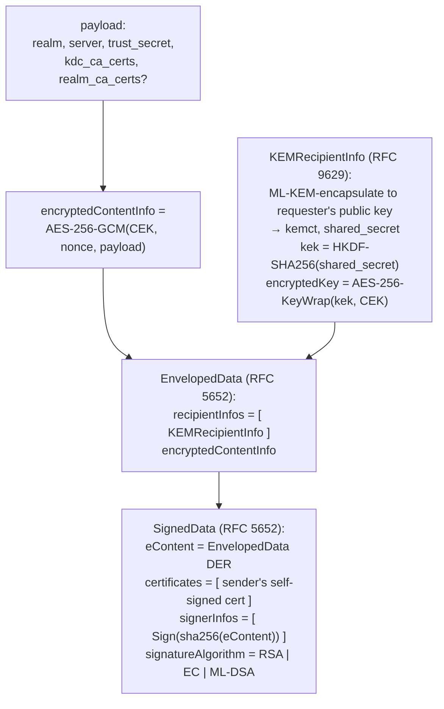
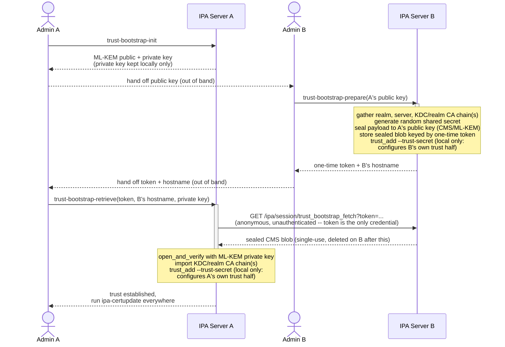
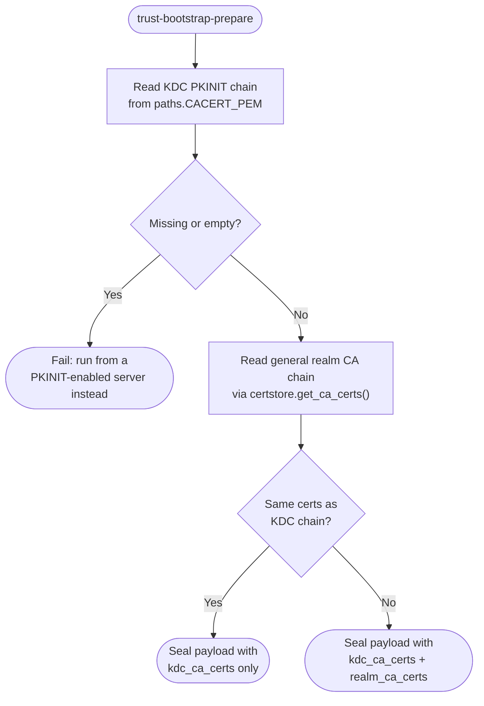
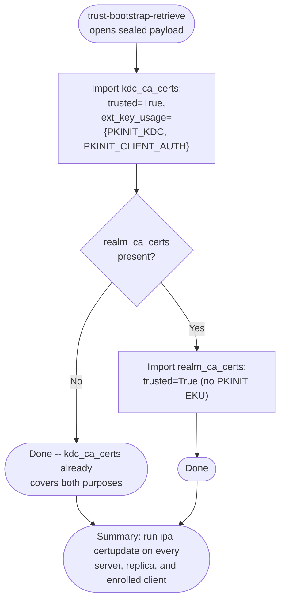

# Create trust between separate IPA deployments

## Overview

FreeIPA provides a way to deploy centrally managed environments where users and
groups can be used to allow access to machines enrolled in the same
environment. Individual applications are hosted on these enrolled machines and
can have Kerberos principals, TLS certificates and other resources associated
with them. HBAC rules can be used to define authorization to access those
applications that use PAM stack. SUDO is one of those applications.  SUDO rules
can be defined to allow transition and execution of individual commands across
multiple sessions for users across those machines.

FreeIPA allows integration with Active Directory environments. The integration
process forms a so-called ‘trust’ relationship: IPA servers trust
authentication decisions made by Active Directory domain controllers of the
trusted forest while those domain controllers allow IPA servers to look up
identity information present in Active Directory. As a result, IPA servers can
also add AD users and groups to local HBAC and SUDO rules and those AD users
can login to machines enrolled in IPA deployment. Kerberos authentication plays
a key role in the trust to Active Directory implementation.

There is no similar solution for two independently deployed IPA environments.
The purpose of this design is to define a way to have two separate IPA
environments to trust each other and provide at least similar level of
functionality as the one existing with Active Directory.


## High level expectations

The aim with trust between two IPA deployments is for it to behave similarly to
trust to Active Directory in day to day operations. As IPA itself provides a
wider feature set than Active Directory in many areas that matter for Linux
systems, we have to take care of more details. However, overall experience
would be similar: once trust is established, users and groups from trusted IPA
deployments will be resolved on the systems belonging to the trusting IPA
deployment, while SUDO and HBAC rules can reference those users and groups
similarly to users and groups from trusted Active Directory forests.


## High level requirements

As IPA deployment A administrator, I would like to be able to establish trust
with another IPA deployment B so that:

* Users from IPA deployment B can be resolved on the machines enrolled in the IPA deployment A by SSSD
* Groups from IPA deployment B can be resolved on the machines enrolled in the IPA deployment A by SSSD
* Users from IPA deployment B can be added to external groups in the IPA deployment A via IPA API
* Groups from IPA deployment B can be added to external groups in the IPA deployment A via IPA API
* Users from IPA deployment B can be added to ID overrides in the IPA deployment A via IPA API
* Groups from IPA deployment B can be added to ID overrides in the IPA deployment A via IPA API
* Users from IPA deployment B can use Kerberos tickets to authenticate to services in the IPA deployment A
* Users from IPA deployment B can manage resources in the IPA deployment A via IPA API

When establishing trust between IPA deployments, the following details should
be taken care of:

* Creating trust information should work with a type of authentication employed
  by the IPA deployment B if this type is supported by the Kerberos
  infrastructure in the IPA deployment A. Namely, passwordless authentication
  methods should be usable for admin users on both sides.
* Information about the IPA deployment B should be discovered automatically given access to the environment with administrative privileges
    * CA chain from IPA deployment B should be made available to IPA deployment
      A to allow secure TLS connections and PKINIT operations
    * ID ranges from IPA deployment B should be made available to IPA
      deployment A to allow selection and filtering at the trust creation time
* It should be possible to establish bi-directional and single-directional trusts.


## High level design

Trust between two IPA deployments will rely on the infrastructure built for
establishing trust between IPA and Active Directory. Key points of this
infrastructure are:

* LDAP server which stores users and groups, along with the details required for MS-PAC issuance
* SSSD daemon with two separate modes for IPA client and IPA server operations
* SSSD support for a set of trusted domains being presented as ‘subdomains’ of the primary IPA domain
* Custom LDAP control to relay user/group resolution requests from SSSD on IPA client to SSSD on IPA server
* Kerberos KDC with ability to issue MS-PAC authorization data in Kerberos tickets

Additionally, in trust between IPA and Active Directory deployments Samba is
utilized to provide DCE RPC services expected by the Active Directory domain
controllers. Since IPA environments don’t require use of DCE RPC services for
their operations, trust between two IPA environments will not require presence
and configuration of Samba as a domain controller on an IPA server.


### LDAP server

IPA utilizes LDAP server to store all information about users, groups,
machines, and other objects presented in IPA environments. LDAP server is
present on each IPA server and the information is replicated across them. IPA
associates a number of attributes with each account, including security
identifier (SID) and POSIX attributes.

Each IPA LDAP server runs the same base set of plugins that, altogether,
implement semantics expected by the SSSD IPA provider. One of these plugins,
ipa-pwd-extop, is used to relay user/group resolution requests between SSSD on
an IPA client and SSSD on an IPA server. When a client needs to resolve a user
or group information from the trusted domain, SSSD will issue an LDAP request
to the IPA LDAP server. This LDAP search has special control operation
information that allows relaying the request to a SSSD instance running on the
IPA server. In turn, an SSSD instance on the IPA server will perform an LDAP
lookup against one of the domain controllers of the trusted domain in question.
Returned information is then relayed back to the LDAP client (SSSD on the IPA
client).


### SSSD on the IPA server

SSSD on the IPA server uses trusted domain object credentials to authenticate
to the domain controllers in a trusted domain. A trusted domain object (TDO)
effectively is an object in the trusted domain that has enough rights to query
information about users and groups. Access to TDO object’s credentials is
protected and is only given to SSSD on the IPA servers via their host object
principals.

Each trusted domain is represented by the SSSD as a subdomain of the primary
IPA domain. This mechanism allows a uniform presentation of all trust
agreements regardless of their type. Both trust to Active Directory and trust
to other IPA deployments will be seen as separate ‘subdomains’ because each
individual IPA or Active Directory deployment has a unique domain suffix.

SSSD presentation of the ‘subdomains’ of the primary IPA domain will need to
change. Currently, SSSD assumes only Active Directory trusts can be represented
as subdomains of the primary IPA domain. This means the internal structure of
that subdomain is always considered the same and is tied to the internal LDAP
schema and directory information tree (DIT) structure of the Active Directory.
In order to represent both AD and IPA subdomains, SSSD code needs to be
modified.

### Kerberos KDC

Kerberos KDC is responsible for issuing tickets. For communication between two
trusted domains, a set of Kerberos principals is created on both sides. These
Kerberos principals have the form of
krbtgt/[TRUSTED.REALM@TRUSTING.REALM](mailto:TRUSTED.REALM@TRUSTING.REALM)
(with TRUSTING.REALM and TRUSTED.REALM interchanged on both sides). A trusted
realm’s domain controller issues a cross-realm ticket granting ticket (TGT)
using this Kerberos principal. Since the principals exist on both sides with
the same key, the resulting ticket can be decrypted by the trusting realm’s
domain controller.

IPA Kerberos KDC performs a number of consistency checks over Kerberos tickets
issued by the trusted realm’s domain controllers. For Active Directory trust, a
requirement is that Kerberos tickets contain MS-PAC authorization data
information. The MS-PAC details allow to match properly both Kerberos and
identity information between POSIX and non-POSIX (Active Directory)
environments.

For the trust between two IPA deployments, the same approach will be taken. IPA
deployments also associate additional identity information with each Kerberos
principal and issues MS-PAC authorization data in the tickets. As a result, no
changes needed to be done to handle trust between two IPA deployments at
Kerberos level in comparison to trust between IPA and Active Directory forests.

### Trust establishment process

#### Active Directory case

For a trust between IPA and Active Directory deployments, IPA servers must run
enough compatible services so that Active Directory domain controllers can
communicate with them as with domain controllers of an Active Directory
deployment. Since IPA LDAP schema and DIT are different from Active Directory,
it was not possible to expose the LDAP server directly to Active Directory.
Instead, a path to represent IPA deployment as a separate Active Directory
forest was chosen. Together with focus on the one-way trust this allowed to
dramatically reduce a need for compatibility in required domain controller
services. IPA servers only need to run Samba to handle DCE RPC services on top
of existing IPA services.

For a trust to an Active Directory forest, only operations over DCE RPC,
authenticated with Kerberos tickets, are required. This also simplified the
process of establishing the trust between IPA and Active Directory. Since
Active Directory LDAP servers support authentication with GSSAPI Kerberos
mechanism with full encryption and data verification, no need to enforce TLS
certificates during the trust establishment process was also required.

#### IPA to IPA case

Contrary to that, use of IPA API is required to communicate with a
trusted-to-be IPA domain controller. IPA API is available over HTTPS end-point
and requires two artifacts:

* TLS certificate chain, in order to verify and trust the remote end-point and
  to be able to handle Kerberos FAST channel against the remote Kerberos KDCs

* Successful authentication as a remote IPA deployment’s user allowed to
  perform administrative operations

To perform authentication as a remote IPA deployment’s user against that remote
IPA domain controller, either the user's password or its active Kerberos ticket
is needed. A system in question also needs to be able to communicate with
remote Kerberos KDC from the remote IPA realm.

FreeIPA provides a number of passwordless authentication methods through
Kerberos: OTP, RADIUS, external IdP authentication, FIDO2 passkeys, and smart
card authentication (PKINIT). All methods but the PKINIT one require use of an
existing Kerberos ticket to create a FAST channel. Typically, either a machine
account credential or an Anonymous PKINIT service is used for this purpose. If
Kerberos realms aren’t trusting each other yet, one cannot reuse the existing
own realm’s PKINIT infrastructure to obtain a local FAST channel.

#### Bootstrapping authentication using encrypted CMS(KEM)

The paragraph above identifies the actual obstacle: creating a trust from IPA
deployment A to IPA deployment B requires *some* credential usable against
deployment B, and every passwordless option FreeIPA offers other than PKINIT
needs a FAST channel that itself depends on a trust relationship that does not
exist yet. PKINIT does not help either, because deployment A has no reason to
trust deployment B's CA chain before the trust is established — that CA chain
is precisely one of the artifacts this whole exchange is meant to deliver.

The key realization is that neither administrator ever needs to authenticate
*to the other realm* at all. Each of `trust-bootstrap-init`,
`trust-bootstrap-prepare`, and `trust-bootstrap-retrieve` (introduced below)
is an ordinary, ACI-protected IPA API command that its admin runs against
their *own* deployment, exactly like any other `ipa` command — authenticated
however that admin's realm already supports (Kerberos SSO, the traditional
password/OTP Web UI form, a smartcard, or other methods.
passwordless login bridged to a local ccache via S4U2Self — see
[webui-oauth2-login.md](webui-oauth2-login.md)). None of that machinery is a
dependency of this design; it is simply unaffected by it, since whichever
method an admin already uses to log into their own realm keeps working
unchanged. This is what actually avoids the FAST-channel/PKINIT chicken-and-egg
problem: there is no step anywhere in this exchange that requires a credential
valid in the *other* realm.

What is still missing is a way to get deployment B's CA chain, KDC/server
address, and a shared trust secret *out of* B and *into* A, without A having
any account or credential on B, and without exposing that material to anyone
but the intended recipient. For that, this design adds a CMS-based envelope
exchange, using ML-KEM (FIPS 203) for the encryption side rather than RSA, and
a configurable classical-or-post-quantum signature (RSA, EC, or ML-DSA/FIPS
204) for sender authentication. The structure happens to mirror the
`SignedData(EnvelopedData)` wire format that
[Ahdapa](https://forge.fedoraproject.org/freeipa/ahdapa) OAuth2/OIDC identity
provider's own inter-node gossip protocol already uses in production (a useful,
independently-reviewed precedent to build on), adapted so the signature
algorithm is a runtime choice rather than fixed to one algorithm:



Precisely, in ASN.1 terms:

```
OUTER: SignedData {
  eContentType = id-envelopedData
  eContent     = <inner EnvelopedData DER>
  certificates = { sender's self-signed signing cert }
  signerInfos  = { SignerInfo { signatureAlgorithm = RSA | EC | ML-DSA,
                                signature = Sign(sha256(eContent)) } }
}
INNER: EnvelopedData {
  recipientInfos = SET OF OtherRecipientInfo {
    oriType  = id-ori-kem
    oriValue = KEMRecipientInfo {
      kem = id-alg-ml-kem-768 (or -1024), kemct = <ML-KEM ciphertext>,
      wrap = id-aes256-wrap, encryptedKey = AES-256-KeyWrap(kek, CEK)
    }
  }
  encryptedContentInfo { AES-256-GCM(CEK, nonce, payload) }
}
kek = HKDF-SHA256(ml_kem_shared_secret, info="ipa-trust-bootstrap-kek", 32)
```

Two distinct keypairs are involved, serving two distinct purposes:

* An **ML-KEM keypair**, generated by the party *requesting* the bootstrap
  (deployment A). ML-KEM keys can only encapsulate/decapsulate a shared
  secret, never sign, so this key is never wrapped in a certificate — only its
  raw public key bytes are exchanged, identified in the CMS structure by a
  `SubjectKeyIdentifier` rather than a full X.509 certificate.
* A **signing keypair**, generated by the party *providing* the bootstrap
  material (deployment B), using whichever of RSA, EC, or ML-DSA is
  configured. Because all three of those algorithms can self-sign, this key
  is wrapped in a minimal self-signed certificate embedded in the outer
  `SignedData`, letting the requester extract the provider's public key
  without any pre-established CA — the same pattern Ahdapa's gossip protocol
  uses for its own node-to-node signing identity.

The end-to-end exchange has three steps:

1. Deployment A generates an ML-KEM keypair and hands the public key to
   deployment B's administrator out of band (there is no existing channel
   between the two realms to carry it over).
2. Deployment B's administrator, already authenticated to their own Web UI via
   Ahdapa (or any other passwordless method — nothing new is required here),
   invokes an IPA API command that gathers B's realm name, server address, CA
   chain, and a freshly generated random shared trust secret; seals that
   bundle to A's ML-KEM public key as described above; stores the result under
   a single-use, time-limited retrieval token; and immediately configures B's
   own half of the trust locally using that same secret. It returns the token
   to relay back to A's administrator out of band.
3. Deployment A's administrator supplies the token to an IPA API command that
   fetches the sealed envelope from an unauthenticated, token-gated endpoint
   on B, opens and verifies it with the ML-KEM private key from step 1,
   imports B's CA chain, and configures A's own half of the trust using the
   retrieved secret.



Neither `ServerA` nor `ServerB` ever authenticates to the other realm in this
exchange — the only cross-realm network call is the anonymous, token-gated
fetch, and the only cross-admin interactions are the two out-of-band hand-offs
shown with dashed arrows.

Trust is established today using a shared secret exactly the way
[one-way trust with shared secret](adtrust/oneway-trust-with-shared-secret.md)
already works for Active Directory: each side writes its own local half of
the trust relationship independently, with no network protocol running
between the two domain controllers during establishment itself. That
property is what makes bidirectional trust safe to bootstrap this way without
coordination: deployment A and deployment B can each act as both requester and
provider, in either order or concurrently, because every step above only ever
mutates local state on the side that runs it.

This is a trust-on-first-use exchange. The retrieval token's entropy, short
lifetime, and single-use consumption are the actual security boundary — an
attacker who does not possess the token cannot retrieve the sealed envelope
at all, regardless of network position. The outer signature adds
tamper-evidence and binds the response to a specific signing key for the
duration of that one exchange, but on first contact there is no independent
way to verify that the embedded signing certificate really belongs to
deployment B's administrator; this is an accepted, explicitly documented
trade-off rather than an oversight. As with the Active Directory shared-secret
flow, establishing trust this way still relies on the existing
Samba/`ipa-adtrust-install` machinery on both sides for the actual trust
object bookkeeping — decoupling `--type ipa` trusts from that Samba
requirement, so that the "no DCE RPC services" goal stated earlier in this
document is fully realized, is left as follow-up work.

##### Which CA chain(s) get sent

A deployment actually has two CA chains that matter here, and they are not
guaranteed to be the same:

* the chain backing *this server's* KDC PKINIT certificate, read directly
  from `/var/kerberos/krb5kdc/cacert.pem` (`paths.CACERT_PEM`, the file
  `krb5kdc`'s own `pkinit_anchors` configuration on that host points at);
* the deployment's general IPA CA chain (`certstore.get_ca_certs()`), used
  for HTTPS/LDAP trust generally.

These are the same in the common case (a KDC certificate issued by the
deployment's own IPA CA, the default), but PKINIT configuration is
per-server, not per-realm: a master or replica can have its KDC certificate
self-signed, IPA CA-issued, or externally issued
(`ipa-server-certinstall -k`) independently of every other server in the
same deployment. `trust-bootstrap-prepare` therefore sends **both** chains,
and de-duplicates when they turn out to be identical: the payload always
carries `kdc_ca_certs` (the PKINIT-specific chain, mandatory), and only adds
a separate `realm_ca_certs` entry when the general chain differs from it.
When they match, `kdc_ca_certs` alone already covers both purposes once
imported (see below) — there is no need to send the same bytes twice. If
the server running `trust-bootstrap-prepare` has no PKINIT CA chain
configured at all (self-signed KDC certificate, or PKINIT not enabled), the
command fails outright rather than silently sending an empty or misleading
chain — run it from a PKINIT-enabled server instead.



##### CA chain propagation to enrolled clients

`trust-bootstrap-retrieve` imports deployment B's `kdc_ca_certs` into
deployment A's certificate store with
`certstore.put_ca_cert(..., trusted=True, ext_key_usage={EKU_PKINIT_KDC,
EKU_PKINIT_CLIENT_AUTH})`, marking it valid for validating PKINIT/KDC
certificates issued within B's realm — this does not narrow the cert to
PKINIT-only use, it remains a generally trusted CA (`trusted=True`) as
well, which is exactly why sending `kdc_ca_certs` alone is sufficient in
the common, de-duplicated case. If B's `realm_ca_certs` was sent
separately (chains differed), those are imported too, as plain trusted
CAs without the PKINIT EKU markers. The command's summary states how many
certificates were imported for which purpose, so the admin isn't left
guessing. Either way, this only affects **the one server that ran the
command** — trust between the two realms exists at that point, but nothing
pushes B's CA chain(s) out to A's *other* servers, replicas, or enrolled
clients. This mirrors an existing FreeIPA limitation, not a new one:
`ipa-cacert-manage install` (used to import any other external CA) has the
exact same property, which is why it prints its own reminder to run
`ipa-certupdate` afterward rather than pushing anything itself — there is no
fleet-wide CA distribution mechanism anywhere in FreeIPA today. Until
`ipa-certupdate` has been run on a given machine, that machine will not
trust B's KDC certificates — for example, it cannot validate an anonymous
PKINIT exchange against a KDC in B. `trust-bootstrap-retrieve` returns a
summary reminding the administrator of this required follow-up step.



This also means bidirectional CA trust is *not* implied by
`--two-way=true`. That flag only marks the Kerberos trust object itself as
bidirectional (letting cross-realm tickets flow in both directions); it has
no effect on which CA chain gets imported where. `trust-bootstrap-prepare`
never receives or imports the requesting side's CA chain — only
`trust-bootstrap-retrieve` imports a chain, and only in the direction it
runs. So if deployment A's clients also need to validate deployment B's
KDC certificates *and* deployment B's clients need to validate deployment
A's, the bootstrap exchange must be run once in each direction (A
requesting from B, and separately B requesting from A), each followed by
`ipa-certupdate` on the respective deployment's machines — not just once
with `--two-way=true`.

##### How to use

`ipa-adtrust-install` must already have been run on both deployments, and
both administrators must be members of the `trust admins` group. Deployment
A is requesting the trust; deployment B is providing it — the roles are
symmetric and either side can play either one.

The raw commands take base64 key material and a token directly as option
values, which works but means copying long blobs between terminals by hand.
The `ipa` CLI's client-side `trust-bootstrap-*` overrides
(`ipaclient/plugins/trust_bootstrap.py`) add a `--out=FILE` option to each
command that instead writes the relevant values to disk, and matching
`--*-file=FILE` input options on the following command that read them back
— so the only manual step is handing the resulting file to the other
administrator (there is no reason to protect that hand-off any more
carefully than you would any other admin-to-admin exchange; see the
security discussion above for what actually protects the exchange).

1. On deployment A:

   ```
   ipa trust-bootstrap-init --out=~/b-trust.key
   ```

   This writes the private key to `~/b-trust.key` (mode 0600 — keep it
   secret, it is the only copy) and the public key to `~/b-trust.key.pub`.
   Send `~/b-trust.key.pub` to deployment B's administrator out of band.

2. On deployment B, already logged in normally (Kerberos or Ahdapa OAuth2
   SSO — nothing special is required here):

   ```
   ipa trust-bootstrap-prepare <A's domain> \
       --remote-kem-public-key-file=<file received from step 1> \
       --out=~/a-trust-info.json \
       [--signature-algorithm=EC|RSA|ML-DSA] \
       [--two-way=true] \
       [--base-id=... --range-size=... --range-type=ipa-ad-trust-posix]
   ```

   This immediately configures B's own half of the trust locally (see
   above — no network round trip to A happens here), and writes the
   single-use retrieval token (valid for `--ttl` seconds, default 3600)
   and B's own hostname to `~/a-trust-info.json` (mode 0600). Send that
   file to A's administrator out of band.

3. On deployment A:

   ```
   ipa trust-bootstrap-retrieve \
       --kem-private-key-file=~/b-trust.key \
       --prepare-info-file=<file received from step 2>
       [--two-way=true]
   ```

   This fetches the sealed package from B's anonymous endpoint, decrypts
   it, imports B's CA chain, and configures A's own half of the trust with
   the secret B generated.

4. Run `ipa-certupdate` on every server, replica, and enrolled client of
   deployment A (step 3's command prints this reminder too) — without it,
   those machines will not trust B's KDC certificates, e.g. for anonymous
   PKINIT against B, even though the trust relationship itself is already
   active. See "CA chain propagation to enrolled clients" above.

`ipa trust-find` should now show the trust on both sides. Passing
`--two-way=true` to *both* `trust-bootstrap-prepare` and
`trust-bootstrap-retrieve` in the same exchange makes the Kerberos trust
object itself bidirectional — but it does **not** give deployment B's
clients A's CA chain (see above). If admins on both sides want their
clients to validate the other realm's KDC certificates too, run the whole
exchange a second time with roles reversed (B requesting from A), followed
by `ipa-certupdate` on deployment B's machines.

The raw, non-file option names (`--remote-kem-public-key`,
`--kem-private-key`, `--server`, `--token`) still work directly wherever a
`--*-file` alternative is shown above, for scripting or when copying a
short value by hand is more convenient than moving a file.

