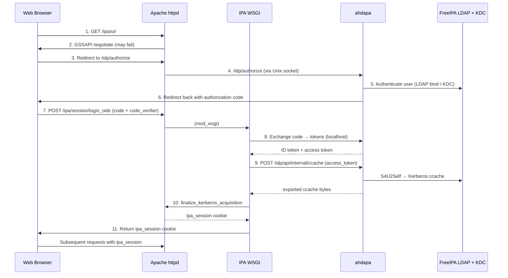

# FreeIPA Web UI login via integrated OAuth2 identity provider

## Overview

FreeIPA Web UI currently implements its own login form with support for
password, OTP, and certificate authentication. Kerberos single sign-on is
handled by Apache mod_auth_gssapi before the login form is ever shown. This
login form duplicates authentication logic that an integrated OAuth2/OIDC
identity provider already implements more comprehensively.

[Ahdapa](https://codeberg.org/freeipa/ahdapa) is an OAuth2/OIDC identity
provider purpose-built for FreeIPA environments. When co-deployed on the same
host as FreeIPA, it authenticates users against the same LDAP and KDC backends
and supports Kerberos SPNEGO, password, OTP, passkeys (FIDO2/WebAuthn),
and federated login through external identity providers configured in IPA.

This design proposes two changes:

1. **Installer integration**: FreeIPA server installation gains the ability to
   deploy, configure, and manage Ahdapa instance as a co-located service,
   following the same patterns used for ipa-custodia.

2. **Web UI authentication redirect**: Instead of showing its own login form,
   the IPA Web UI redirects unauthenticated users to Ahdapa's OAuth2
   authorization endpoint. After successful authentication, Ahdapa redirects
   back to the IPA Web UI with an authorization code. A new server-side
   endpoint exchanges the code for tokens and establishes a standard IPA
   session.

Both the Classic UI (Dojo/PatternFly at `/ipa/ui/`) and the Modern UI
(React at `/ipa/modern-ui/`) benefit from the same backend changes.

### Background

The existing [external identity provider](external-idp/external-idp.md) design
addresses OAuth 2.0 Device Authorization Grant for Kerberos- and SSSD-based
logins on IPA-enrolled machines. That design uses SSSD as the OAuth2 client and
the KDC as the token verifier. The current proposal is complementary: it
addresses browser-based Web UI authentication using the standard Authorization
Code flow with PKCE, with Ahdapa serving as both the authorization server and
authentication frontend.

## Use Cases

### UC1: User without Kerberos ticket accesses IPA Web UI

A user opens `https://ipa.example.com/ipa/ui/` in a browser without a valid
Kerberos ticket. Instead of seeing IPA's built-in login form, the browser is
redirected to Ahdapa's login page at `https://ipa.example.com/idp/authorize`.
The user authenticates using any method Ahdapa supports (password, OTP,
passkey, or federated identity). Upon success, the browser redirects back to
the IPA Web UI with a valid session, and the user can manage IPA resources.

### UC2: User with Kerberos ticket gets seamless SSO

A domain user with a valid Kerberos ticket opens the IPA Web UI. Apache
`mod_auth_gssapi` negotiates credentials via SPNEGO and establishes the IPA
session before the Web UI JavaScript loads. The OAuth2 redirect never triggers.
This behavior is unchanged from the current implementation.

### UC3: Ahdapa is deployed automatically during IPA server installation

`ipa-server-install` deploys Ahdapa by default alongside the other IPA
services. The installer deploys configuration files, sets up gssproxy,
configures the Apache reverse proxy, enables S4U2Self delegation on the HTTP
service principal, registers the IPA Web UI as a static OIDC client, and
creates the HBAC rule and `krb5:ccache` scope needed for credential exchange.
The system user and SELinux policy are provided by the ahdapa RPM package.
On replicas, `ipa-replica-install` performs the same steps. Administrators can
opt out with `--no-idp` if Ahdapa is not desired. Note that in case Ahdapa is
not co-deployed, login to this replica's Web UI will only be possible with
password and OTP via the traditional login page.

### UC4: Administrator adds Ahdapa to an existing IPA deployment

**Not yet implemented.** On an existing IPA server that was installed with
`--no-idp`, there is currently no standalone command to deploy Ahdapa after
the fact. The `upgrade_instance()` method only re-configures Ahdapa if it
was previously installed (the `ahdapa/installed` sysupgrade flag is set).
A dedicated `ipa-idp-install` command is planned for a future iteration.

### UC5: Multi-node topology with Ahdapa

Ahdapa instances to be deployed on all IPA replicas. Each instance discovers
peers via the IPA replication topology and synchronizes state through a gossip
protocol. All nodes use the same issuer URL (typically
`https://ipa-ca.example.com/idp`) so tokens are valid cluster-wide.

## How to Use

### Default installation

Ahdapa instance is deployed automatically during server and replica installation.
No additional flags are needed:

```bash
ipa-server-install \
    --realm EXAMPLE.COM \
    --domain example.com \
    ...
```

To skip Ahdapa deployment:

```bash
ipa-server-install --no-idp ...
ipa-replica-install --no-idp ...
```

### Adding Ahdapa to an existing server

If the server was installed with `--no-idp`, there is currently no
standalone command to add Ahdapa after the fact. A dedicated
`ipa-idp-install` command is planned for a future iteration.

### Using the Web UI with OAuth2 login

Once Ahdapa is deployed, the Web UI automatically detects its presence and
redirects unauthenticated users to Ahdapa. No additional configuration is
needed.

1. Open `https://ipa.example.com/ipa/ui/` (or `/ipa/modern-ui/`)
2. If no Kerberos ticket is available, the browser is redirected to Ahdapa
3. Authenticate on the Ahdapa login page
4. After successful authentication, the browser returns to the IPA Web UI
   with an active session

## Design

### Architecture overview



### Part 1: Installer integration

Ahdapa instance installation follows the pattern established by ipa-custodia: a
service instance class manages the deployment lifecycle.

#### Service registration

A new entry in `ipaserver/masters.py`:

```python
service_definition('ahdapa', 42, 'IDP'),
```

Start order 42 places ahdapa after custodia (41) and before the CA (50). The
service entry name `IDP` is used in LDAP under
`cn=IDP,cn=<hostname>,cn=masters,cn=ipa,cn=etc,<suffix>`.

#### File paths

New entries in `ipaplatform/base/paths.py`:

| Constant | Value |
|----------|-------|
| `AHDAPA_CONF_DIR` | `/etc/ahdapa` |
| `AHDAPA_CONF` | `/etc/ahdapa/ahdapa.toml` |
| `AHDAPA_CLIENTS_CONF` | `/etc/ahdapa/clients.toml` |
| `AHDAPA_STATE_DIR` | `/var/lib/ahdapa` |
| `AHDAPA_SOCKET_DIR` | `/run/ahdapa` |
| `AHDAPA_SOCKET` | `/run/ahdapa/ahdapa.sock` |
| `AHDAPA_CCACHE` | `/run/ahdapa/ahdapa.ccache` |
| `AHDAPA_GSSPROXY_CONF` | `/etc/gssproxy/20-ahdapa.conf` |
| `AHDAPACTL` | `/usr/bin/ahdapactl` |
| `HTTPD_IPA_IDP_PROXY_CONF` | `/etc/httpd/conf.d/ipa-idp-proxy.conf` |

#### Configuration files deployed

**1. `/etc/ahdapa/ahdapa.toml`** (owner: ahdapa:ahdapa, mode: 0600)

Main server configuration with sections for:
- `[server]`: issuer URL, realm, display name, Unix socket listener,
  auth rate limit
- `[db]`: SQLite database URL, max connections
- `[gssapi]`: gssproxy integration, service principal, initiator principal,
  ccache path
- `[ipa]`: LDAP URI (`ldapi://`), cache TTL
- `[clients]`: path to the static client registration file
- `[webui]`: path to ahdapa's own Web UI static assets
- `[tokens]`: token lifetimes (access 15m, refresh 8h, auth code 60s,
  session 10h)
- `[gossip]`: IPA topology-based peer discovery
- `[[rbac.role]]` and `[[rbac.group_role]]`: RBAC mapping from IPA groups

Template: `install/share/ahdapa.toml.template`

**2. `/etc/ahdapa/clients.toml`** (owner: ahdapa:ahdapa, mode: 0600)

Static OAuth2 client registration for the IPA Web UI. Referenced from
`ahdapa.toml` via `[clients] file = ...`. Contains a `[[client]]` entry
with `client_id`, `client_name`, `token_endpoint_auth_method`,
`scopes`, `grant_types`, and `redirect_uris`.

Template: `install/share/ahdapa-clients.toml.template`

**3. `/etc/gssproxy/20-ahdapa.conf`** (owner: root:root, mode: 0644)

Grants `ahdapa` process access to the HTTP service keytab with S4U2Self and
S4U2Proxy capabilities:

```ini
[service/ahdapa]
  mechs = krb5
  cred_store = keytab:$HTTP_KEYTAB
  cred_store = client_keytab:$HTTP_KEYTAB
  allow_protocol_transition = true
  cred_usage = both
  euid = $AHDAPA_USER
```

The `$AHDAPA_USER` variable is substituted with the numeric UID of the
`ahdapa` system user at install time.

Template: `install/share/ahdapa-gssproxy.conf.template`

**4. `/etc/httpd/conf.d/ipa-idp-proxy.conf`** (owner: root:root, mode: 0644)

Apache reverse proxy configuration routing `/idp/*` to Ahdapa's Unix socket.
Includes security headers (X-Content-Type-Options, X-Frame-Options,
Content-Security-Policy), a permanent redirect from `/idp` to `/idp/`,
and a rewrite rule to enforce HTTPS:

```apache
ProxyPass        /idp/  unix:$AHDAPA_SOCKET|http://localhost/  nocanon
ProxyPassReverse /idp/  http://localhost/
ProxyPassReverseCookiePath / /idp/
ProxyPreserveHost On

RedirectMatch permanent ^/idp$ /idp/

<Location "/idp/">
    AuthType None
    Require all granted
    SSLOptions +StdEnvVars +ExportCertData +StrictRequire
    SSLVerifyClient none
    RequestHeader set X-Forwarded-Proto "https"
    Header always set    X-Content-Type-Options "nosniff"
    Header always append X-Frame-Options "DENY"
    Header always append Content-Security-Policy "frame-ancestors 'none'"
</Location>

RewriteCond %{SERVER_PORT} !^443$
RewriteRule ^/idp/(.*)     https://%{HTTP_HOST}/idp/$1 [L,R=307,NC]
```

Template: `install/share/ipa-idp-proxy.conf.template`

#### System user and directories

The `ahdapa` system user and runtime directories are created by the ahdapa
RPM package. The installer verifies that the user exists (via
`_get_ahdapa_user()`) and sets ownership on the configuration directory:

| Path | Owner | Mode | Purpose |
|------|-------|------|---------|
| `/etc/ahdapa/` | ahdapa:ahdapa | 0755 | Configuration |
| `/etc/ahdapa/ahdapa.toml` | ahdapa:ahdapa | 0600 | Main config |
| `/etc/ahdapa/clients.toml` | ahdapa:ahdapa | 0600 | Client registration |

#### LDAP container

The installer creates an LDAP container `cn=ahdapa,cn=ipa,cn=etc,<suffix>`
via the update file `install/updates/78-ahdapa.update`. This is an
idempotent operation that creates the entry only if it does not already
exist.

#### S4U2Self delegation

The installer sets `ipakrboktoauthasdelegate=True` on the HTTP service
principal (`HTTP/<hostname>@REALM`) so that S4U2Self tickets obtained by
Ahdapa (via gssproxy and the HTTP keytab) are forwardable. This is
required for the Kerberos ccache exchange to produce usable credentials.

#### HBAC rule and scope provisioning

After starting Ahdapa, the installer uses the `ahdapactl` command-line
tool to create:

- A `krb5:ccache` scope (if it does not already exist), which authorizes
  clients to request Kerberos credential exchange
- An HBAC rule named "IPA Web UI access", granting users in the
  `ipausers` group access to the `openid,profile,krb5:ccache` scopes for
  each replica's own `ipa-webui-<hostname>` client (see
  [OIDC client registration](#oidc-client-registration))

This is one shared, gossip-synced rule across the whole cluster: the first
replica to run creates it with its own client_id; every later replica's
install/upgrade adds its own client_id to the existing rule
(`ahdapactl hbac update <id> --add-clients ...`) rather than skipping past
it, since replicas do not all share a single client_id (see below).

These operations are performed after Ahdapa is running because they use
Ahdapa's own API (`ahdapactl --url ... --kerberos`).

#### SELinux policy

The SELinux policy module for Ahdapa is shipped by the `ahdapa` RPM package,
not by FreeIPA. The FreeIPA installer does not install or manage the SELinux
policy itself. The policy defines the `ahdapa_t` domain, file contexts for
configuration, state, and runtime directories, and grants the necessary
network and Unix socket access for LDAP, Kerberos, and the httpd reverse
proxy.

#### OIDC client registration

The IPA Web UI OAuth2 client is registered statically via the
`/etc/ahdapa/clients.toml` configuration file, deployed from
`install/share/ahdapa-clients.toml.template`. The client ID is per-replica
(`ipa-webui-<hostname>`), computed by the `idp_client_id(fqdn)` function in
`ahdapainstance.py` and imported by `rpcserver.py` -- not a single shared
constant. Ahdapa's client store is gossip-synced cluster-wide, so a single
shared client_id would have each replica's config render overwrite the
redirect_uris the others depend on; per-host IDs let every replica register
independently without colliding.

```toml
[[client]]
client_id                  = "ipa-webui-<hostname>"
client_name                = "FreeIPA Web UI"
token_endpoint_auth_method = "none"
scopes                     = ["openid", "profile", "krb5:ccache"]
grant_types                = ["authorization_code"]
redirect_uris              = [
    "https://<hostname>/ipa/ui/",
    "https://<hostname>/ipa/modern-ui/",
]
skip_consent               = true
```

This is a public client (no secret) because the authorization code exchange
is performed server-side by the IPA WSGI handler. The `krb5:ccache` scope
authorizes the client to request Kerberos credential exchange from Ahdapa's
internal ccache endpoint. `skip_consent` is set because this is FreeIPA's
own first-party Web UI, not a third party requesting delegated access --
without it, ahdapa would show a consent screen on every single login.

#### Installer class

New file `ipaserver/install/ahdapainstance.py` implementing `AhdapaInstance`,
modeled after `CustodiaInstance`. It defines `idp_client_id(fqdn)`, a
function (not a constant, since the value is per-replica) imported by
`rpcserver.py`.

```python
class AhdapaInstance(SimpleServiceInstance):
    def __init__(self, fstore=None):
        super().__init__("ahdapa")

    def create_instance(self, realm, host_name, domain, ldap_suffix=None):
        self.step("creating ahdapa container",
                  self._create_container)
        self.step("enabling S4U2Self delegation on HTTP service",
                  self._enable_delegation)
        self.step("configuring ahdapa",
                  self._configure_ahdapa)
        self.step("configuring gssproxy for ahdapa",
                  self._configure_gssproxy)
        self.step("configuring httpd proxy for ahdapa",
                  self._configure_httpd_proxy)
        # ... SimpleServiceInstance.create_instance starts the service ...
        # After the service is running:
        self._configure_hbac()  # creates krb5:ccache scope and HBAC rule
```

The `_create_container` method runs the `78-ahdapa.update` LDAP update.
The `_enable_delegation` method sets `ipakrboktoauthasdelegate=True` on
the HTTP service principal if not already set. The `_configure_ahdapa`
method deploys both `ahdapa.toml` and `clients.toml` using `_write_secure`
(atomic write via `os.open` with explicit mode 0o600 and `os.fchown`).
The `_configure_hbac` method runs after Ahdapa is started and uses
`ahdapactl` to create the `krb5:ccache` scope and HBAC rule.

#### Uninstallation

The `AhdapaInstance.uninstall()` method reverses the installation:
- Stops and disables the ahdapa service (via `SimpleServiceInstance`)
- Restores or removes configuration files: `ipa-idp-proxy.conf`,
  `20-ahdapa.conf`, `clients.toml`, and `ahdapa.toml` (using `fstore`
  backup restoration or `ipautil.remove_file`)
- Sets the upgrade state to `installed=False`

### Part 2: Web UI OAuth2 authentication flow

#### OAuth2 flow selection

The implementation uses the **OAuth 2.0 Authorization Code flow with PKCE**
(RFC 7636, RFC 6749). This is the recommended flow for browser-based
applications per current best practices.

The alternative of using mod_auth_openidc at the Apache layer was rejected
because:
- It would conflict with the existing mod_auth_gssapi configuration that
  protects `/ipa` with Kerberos sessions and impersonation
- It cannot bridge OIDC tokens to Kerberos ccaches (needed for IPA's LDAP
  backend)
- It would introduce a new Apache module dependency

#### New server endpoint: `login_oidc`

A new WSGI handler class `login_oidc` is added to `ipaserver/rpcserver.py`,
extending `Backend` and `KerberosSession`. It is registered as a plugin via
`ipaserver/plugins/xmlserver.py`.

The handler serves two functions on the same mount point:

**GET `/ipa/session/login_oidc`** — returns OIDC configuration:

```json
{
    "authorization_endpoint": "https://ipa.example.com/idp/authorize",
    "client_id": "ipa-webui-ipa.example.com",
    "redirect_uri": "https://ipa.example.com/ipa/ui/",
    "scopes": "openid profile krb5:ccache"
}
```

Availability is determined by checking whether the file
`HTTPD_IPA_IDP_PROXY_CONF` (`/etc/httpd/conf.d/ipa-idp-proxy.conf`) exists.
This file is chosen instead of `AHDAPA_CONF` because the ahdapa configuration
file has mode 0600 and is unreadable by the Apache WSGI process. Returns 404
if the proxy configuration file is absent, allowing the UI to detect
availability.

**POST `/ipa/session/login_oidc`** — handles the authorization code exchange:

1. **Receive** `code`, `code_verifier`, and `redirect_uri` from the
   request body (form-encoded). The `redirect_uri` is validated against a
   whitelist of allowed UI paths (`/ipa/ui/` and `/ipa/modern-ui/`);
   if not provided, it defaults to `/ipa/ui/`.
2. **Exchange** the authorization code for tokens via a server-to-server POST
   to Ahdapa's token endpoint (`https://<host>/idp/token`) with TLS
   verification against the IPA CA certificate. The request includes:
   - `grant_type=authorization_code`
   - `code=<authorization code>`
   - `redirect_uri=<must match what was used in authorize>`
   - `client_id=ipa-webui-<host>` (from `idp_client_id(host)`)
   - `code_verifier=<PKCE verifier from browser>`
3. **Validate** the ID token: base64url-decode the JWT payload (no
   cryptographic signature verification, since the token exchange is
   server-to-server over TLS to localhost with IPA CA verification).
   Check that `iss` matches `https://<host>/idp` and that `aud` contains
   `idp_client_id(host)` (the `aud` claim may be a string or an array).
4. **Extract** the username from the `sub` claim.
5. **Obtain Kerberos ccache via Ahdapa**: POST the `access_token` (obtained
   in step 2 with `krb5:ccache` scope) to Ahdapa's internal ccache endpoint
   (`https://<host>/idp/api/internal/ccache`) with a Bearer authorization
   header. Ahdapa performs S4U2Self on behalf of the authenticated user
   and returns exported Kerberos ccache bytes.
6. **Write ccache and finalize session**: write the exported ccache bytes to
   a temporary file in `IPA_CCACHES`, then call
   `self.finalize_kerberos_acquisition()` which connects back to
   `http://localhost/ipa/session/cookie` using the ccache.
   `mod_auth_gssapi` issues a standard `ipa_session` cookie. The temporary
   ccache file is removed after use.
7. **Return** the `IPASESSION` cookie in the response headers

#### Apache configuration

A location exemption for the OIDC endpoint is added to `ipa.conf.template`:

```apache
# Turn off Apache authentication for OIDC login via integrated IdP
<Location "/ipa/session/login_oidc">
  Satisfy Any
  Require all granted
</Location>
```

This follows the same pattern as the existing exemptions for
`/ipa/session/login_password` and `/ipa/session/change_password`.

#### Classic UI JavaScript changes

**`install/ui/src/freeipa/config.js`** — new config property:

- `oidc_login_url: '/ipa/session/login_oidc'` added alongside the
  existing login URL properties.

**`install/ui/src/freeipa/ipa.js`** — new functions:

`IPA.login_oidc()`:
1. Fetch OIDC configuration from `GET /ipa/session/login_oidc`
   (via `config.oidc_login_url`)
2. Generate PKCE `code_verifier` (48 random bytes, base64url-encoded) and
   `code_challenge` (SHA-256 hash, base64url-encoded) using the Web Crypto API
3. Generate a random `state` parameter (same generation method)
4. Store `code_verifier` and `state` in `window.sessionStorage` under keys
   `oidc_code_verifier` and `oidc_state`
5. Redirect the browser to the authorization endpoint:
   ```
   /idp/authorize?response_type=code
     &client_id=ipa-webui-<host>
     &redirect_uri=https://<host>/ipa/ui/
     &scope=openid+profile+krb5%3Accache
     &state=<random>
     &code_challenge=<S256 challenge>
     &code_challenge_method=S256
   ```
6. Returns a Deferred that resolves to `'unavailable'` if the GET request
   fails (ahdapa not configured) or if the Web Crypto API fails. On
   successful redirect the Deferred is intentionally not resolved.

`IPA.complete_oidc_login(code, state)`:
1. Retrieve `code_verifier` and expected `state` from `sessionStorage`
2. Remove both items from `sessionStorage` immediately
3. If `state` does not match, resolve with `'invalid-state'`
4. If `code_verifier` is missing, resolve with `'missing-verifier'`
5. Construct `redirect_uri` from `window.location` (protocol + host + pathname)
6. POST to `/ipa/session/login_oidc` with `code`, `code_verifier`, and
   `redirect_uri` (form-encoded)
7. On success: set `auth.current.authenticated` to `true` with method
   `'oidc'`, resolve with `'success'`
8. On error: resolve with the `X-IPA-Rejection-Reason` header value or
   `'failed'`

`IPA.logout()`:
1. Call the existing `session_logout` JSON-RPC endpoint
2. On success or 401 response, call `POST /idp/api/auth/logout` to
   terminate the Ahdapa session before reloading the page
3. Set `sessionStorage.logout = true` so the next page load shows the
   login form

**`install/ui/src/freeipa/Application_controller.js`** — modifications:

- `on_authenticate()` now tries `IPA.login_oidc()` first. If the Deferred
  resolves to `'unavailable'` (ahdapa not deployed), it falls back to
  `_show_login_ui()` which shows the classic login form. If ahdapa is
  available, the browser redirects to the IdP and this code path is not
  reached.

**`install/ui/src/freeipa/widgets/LoginScreen.js`** — modifications:

- Add a "Log In Using Single Sign-On" button in `render_buttons()`. The
  button is **hidden by default** (`display: none`) and only shown after a
  successful GET probe to `/ipa/session/login_oidc` confirms that ahdapa
  is available (`_check_oidc_availability()`).
- Add `login_with_oidc()` method that calls `IPA.login_oidc()`

**`install/ui/src/freeipa/app_container.js`** — modifications:

- During SPA initialization (in the `register_phases` `init` handler),
  check if the URL contains `code` and `state` query parameters using
  `URLSearchParams`
- If present, call `IPA.complete_oidc_login(code, state)` to exchange
  the code
- After completion, strip the query parameters from the URL using
  `window.history.replaceState`
- If the exchange fails, set `sessionStorage.logout = true` to trigger
  the login form display

#### Modern UI changes

The Modern UI (React SPA at `/ipa/modern-ui/`) applies the same pattern:
- Check for OIDC callback parameters on mount
- Add OIDC login button to the login page
- Use the same `/ipa/session/login_oidc` backend endpoint

Since the Modern UI is maintained in a separate git repository
(`freeipa-webui`), those changes are tracked separately but share the same
backend.

#### Session management

Sessions established via OAuth2 login use the same `ipa_session` cookie and
mod_session infrastructure as all other authentication methods. The session
lifetime is governed by Apache's `SessionMaxAge` directive, not by the OAuth2
token lifetimes.

Ahdapa maintains its own session cookie (`session`, scoped to `/idp/`) which
is independent of the IPA session. To provide full logout, `IPA.logout()` in
`ipa.js` calls `POST /idp/api/auth/logout` after terminating the IPA session,
before reloading the page. This ensures both the IPA session and the Ahdapa
session are invalidated together.

### Security considerations

**PKCE is mandatory.** The authorization code flow uses PKCE with S256. The
code_verifier is generated in the browser, stored in `sessionStorage`, and
sent only to the IPA backend (never to the authorization server directly). The
IPA backend includes it in the server-to-server token exchange.

**State parameter.** A random state value protects against CSRF. It is
generated by JavaScript, stored in `sessionStorage`, and validated when the
callback arrives.

**Token validation.** The ID token is validated server-side in Python:
the JWT payload is base64url-decoded and the `iss` and `aud` claims are
checked. Full cryptographic signature verification against Ahdapa's JWKS is
not performed because the token exchange is a server-to-server request over
TLS to localhost with IPA CA certificate verification, making the transport
itself the trust boundary.

**No tokens in the browser.** The browser never receives or stores OAuth2
access tokens. It only handles the authorization code transiently. After the
code exchange, the browser receives an `ipa_session` cookie.

**Localhost token exchange.** The code-for-tokens exchange is a server-to-server
request on the same host. No OAuth2 tokens traverse the network between IPA
and Ahdapa.

**S4U2Self delegation.** The HTTP service principal has
`ipakrboktoauthasdelegate=True` set by the installer, so S4U2Self tickets
are forwardable. Protocol transition is configured via gssproxy
(`allow_protocol_transition = true`). Ahdapa performs the actual S4U2Self
operation when the IPA backend POSTs the access token to
`/idp/api/internal/ccache`. The IPA WSGI process does not perform S4U2Self
directly.

**Referer checking.** The existing `check_referer()` method in `HTTP_Status`
validates that requests originate from `https://<ipa_host>/ipa/`. Since the
code exchange POST comes from the UI JavaScript (running on `/ipa/ui/`), the
referer check passes.

## Implementation

### New files

| File | Purpose |
|------|---------|
| `ipaserver/install/ahdapainstance.py` | Installer class for ahdapa service; defines `idp_client_id(fqdn)` |
| `install/share/ahdapa.toml.template` | ahdapa main configuration template |
| `install/share/ahdapa-clients.toml.template` | Static OAuth2 client registration template |
| `install/share/ahdapa-gssproxy.conf.template` | gssproxy drop-in template |
| `install/share/ipa-idp-proxy.conf.template` | Apache reverse proxy template |
| `install/updates/78-ahdapa.update` | LDAP update for ahdapa container |

### Modified files

| File | Change |
|------|--------|
| `ipaserver/masters.py` | Add `service_definition('ahdapa', 42, 'IDP')` |
| `ipaplatform/base/paths.py` | Add ahdapa file path constants (`AHDAPA_CONF`, `AHDAPA_CLIENTS_CONF`, `AHDAPA_STATE_DIR`, `AHDAPA_SOCKET_DIR`, `AHDAPA_SOCKET`, `AHDAPA_CCACHE`, `AHDAPA_GSSPROXY_CONF`, `AHDAPACTL`, `HTTPD_IPA_IDP_PROXY_CONF`) |
| `ipaserver/rpcserver.py` | Add `login_oidc` WSGI handler class; import `idp_client_id` from `ahdapainstance` |
| `ipaserver/plugins/xmlserver.py` | Register `login_oidc` handler |
| `install/share/ipa.conf.template` | Add Location exemption for `login_oidc` |
| `install/ui/src/freeipa/config.js` | Add `oidc_login_url` property |
| `install/ui/src/freeipa/ipa.js` | Add `login_oidc()`, `complete_oidc_login()`, and IdP logout in `IPA.logout()` |
| `install/ui/src/freeipa/widgets/LoginScreen.js` | Add SSO login button (hidden by default, shown after OIDC probe) |
| `install/ui/src/freeipa/Application_controller.js` | Auto-redirect to IdP in `on_authenticate()` with fallback to login form |
| `install/ui/src/freeipa/app_container.js` | Handle OIDC callback (`code`+`state` parameters) on init |
| `ipaserver/install/server/install.py` | Import `ahdapainstance`; call `AhdapaInstance.create_instance()` guarded by `not options.no_idp`; call `AhdapaInstance.uninstall()` in uninstall path |
| `ipaserver/install/server/replicainstall.py` | Import `ahdapainstance`; call `AhdapaInstance.create_instance()` guarded by `not options.no_idp` |
| `ipaserver/install/server/upgrade.py` | Import `ahdapainstance`; call `AhdapaInstance.upgrade_instance()` |
| `install/share/Makefile.am` | Add ahdapa template files and proxy config template |
| `install/updates/Makefile.am` | Add `78-ahdapa.update` |
| `freeipa.spec.in` | Add `Requires: ahdapa` to ipa-server package |

### Dependencies

- **ahdapa package**: declared as `Requires: ahdapa` in the ipa-server RPM
  specfile. The ahdapa binary, `ahdapactl` CLI tool, Web UI assets, systemd
  unit, SELinux policy, and system user are all provided by the ahdapa
  RPM package.
- **No new Apache modules**: mod_proxy (already available) handles the reverse
  proxy. mod_auth_openidc is not required.
- **No new Python dependencies**: `rpcserver.py` uses `requests` (already a
  FreeIPA dependency) for the token exchange and ccache retrieval.
  `idp_client_id` is imported from `ahdapainstance`.

### Backup and Restore

The following files are backed up during installation (via `fstore`) and
restored on uninstall:
- `/etc/httpd/conf.d/ipa-idp-proxy.conf`
- `/etc/gssproxy/20-ahdapa.conf`
- `/etc/ahdapa/clients.toml`
- `/etc/ahdapa/ahdapa.toml`

The ahdapa database (`/var/lib/ahdapa/ahdapa.db`) should be included in
IPA backup (`ipa-backup`) when Ahdapa is deployed.

## Feature Management

### UI

Both Web UIs gain a "Log In Using Single Sign-On" button on the login screen.
The button is **hidden by default** and only shown after a GET probe to
`/ipa/session/login_oidc` confirms that ahdapa is deployed (returns 200).

When ahdapa is deployed, the `on_authenticate` handler in
`Application_controller.js` automatically tries `IPA.login_oidc()` first,
redirecting the user to the IdP login page. The classic login form is only
shown as a fallback if the IdP is unavailable. There is no separate
configuration attribute to control this behavior.

### CLI

| Command | Options |
|---------|---------|
| `ipa-server-install` | `--no-idp` — skip ahdapa deployment (deployed by default) |
| `ipa-replica-install` | `--no-idp` — skip ahdapa deployment (deployed by default) |

### Configuration

No additional LDAP configuration is required. The Web UI detects Ahdapa
availability by probing the `GET /ipa/session/login_oidc` endpoint. The
server-side handler checks for the presence of the
`/etc/httpd/conf.d/ipa-idp-proxy.conf` file. If Ahdapa is deployed, the
endpoint returns OIDC configuration and the UI redirects to ahdapa
automatically. If ahdapa is not deployed, the endpoint returns 404 and the
UI falls back to the built-in login form.

## Upgrade

When upgrading an IPA server that already has Ahdapa deployed:

1. `AhdapaInstance.upgrade_instance()` is called from `upgrade.py`. It
   checks the `sysupgrade` state for `ahdapa/installed`. If installed,
   it re-deploys configuration files (`ahdapa.toml`, `clients.toml`,
   gssproxy, httpd proxy) and restarts the service. If the configuration
   file is missing, a full reinstallation is triggered.

2. The Apache configuration template version is incremented (VERSION line in
   `ipa.conf.template`). The upgrade process regenerates `ipa.conf` from the
   template, adding the `login_oidc` location exemption.

3. The LDAP update file `78-ahdapa.update` is idempotent — it creates entries
   only if they do not already exist.

## Test plan

### Unit tests

- `login_oidc` handler: test code exchange with mocked Ahdapa token endpoint,
  ID token validation, error handling for invalid/expired tokens
- PKCE challenge generation and verification

### Integration tests

1. **OIDC login flow**: deploy IPA (Ahdapa included by default), open Web UI, verify
   redirect to Ahdapa, authenticate with password, verify session is
   established, verify IPA RPC calls succeed

2. **Kerberos SSO preserved**: with valid Kerberos ticket, verify the user is
   authenticated via SPNEGO without seeing the Ahdapa login page

3. **Password fallback**: verify the built-in password login form still works
   when Ahdapa is not deployed (--no-idp)

4. **Multi-replica**: deploy Ahdapa on two replicas, verify a session
   obtained from one replica is valid on the other

6. **Install/uninstall**: verify `ipa-server-install` deploys Ahdapa by
   default, and that `ipa-server-install --uninstall` correctly removes all
   configuration files, LDAP entries, and services

7. **Upgrade**: verify that upgrading from a version without this feature
   does not break existing authentication

## Troubleshooting and debugging

### Checking ahdapa status

```bash
systemctl status ahdapa
journalctl -u ahdapa -f
```

### Verifying OIDC discovery

```bash
curl -s https://ipa.example.com/idp/.well-known/openid-configuration | python3 -m json.tool
```

### Verifying the IPA OIDC endpoint

```bash
curl -s https://ipa.example.com/ipa/session/login_oidc
```

Returns JSON with authorization endpoint configuration if Ahdapa is
deployed, or 404 if not.

### Common issues

**Login redirect fails with "invalid_client":**
The IPA Web UI client for this host (`ipa-webui-<hostname>`) is not
registered in Ahdapa. Verify that `/etc/ahdapa/clients.toml` exists and
contains a `[[client]]` entry with `client_id = "ipa-webui-<hostname>"`
matching this host's own FQDN. If the file is missing, reinstalling or
upgrading the server should regenerate it.

**Code exchange fails with "invalid_grant":**
The authorization code has expired (default: 60 seconds) or the `code_verifier`
does not match the `code_challenge`. Check browser `sessionStorage` for stale
PKCE state.

**Session not established after redirect:**
The ccache exchange or S4U2Self operation in Ahdapa failed. Check:
```bash
journalctl -u ahdapa -f
journalctl -u gssproxy -f
```
Verify `/etc/gssproxy/20-ahdapa.conf` has `allow_protocol_transition = true`
and that the HTTP service principal has `ipakrboktoauthasdelegate=True`:
```bash
ipa service-show HTTP/<hostname>@REALM --all | grep oktoauthasdelegate
```

**502 Bad Gateway on `/idp/` paths:**
Apache cannot connect to ahdapa's Unix socket. Verify:
```bash
ls -la /run/ahdapa/ahdapa.sock
# Should be: srw-rw---- ahdapa apache
```

**ahdapa cannot access LDAP:**
Check GSSAPI authentication to the local Directory Server:
```bash
KRB5CCNAME=/run/ahdapa/ahdapa.ccache ldapsearch -Y GSSAPI -b "" -s base
```

### Log locations

| Component | Log |
|-----------|-----|
| ahdapa | `journalctl -u ahdapa` |
| Apache (proxy) | `/var/log/httpd/error_log` |
| gssproxy | `journalctl -u gssproxy` |
| IPA WSGI | `/var/log/httpd/error_log` (mod_wsgi stderr) |
| Kerberos (KDC) | `journalctl -u krb5kdc` |
