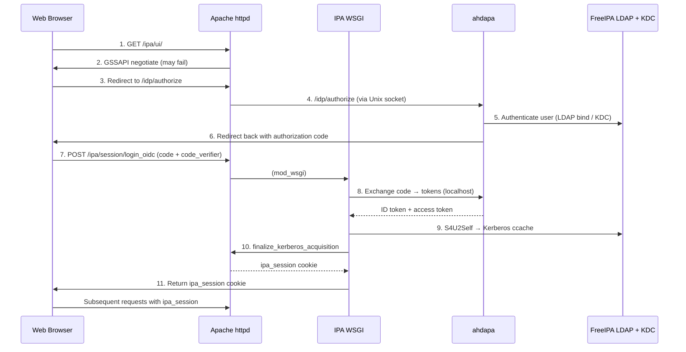
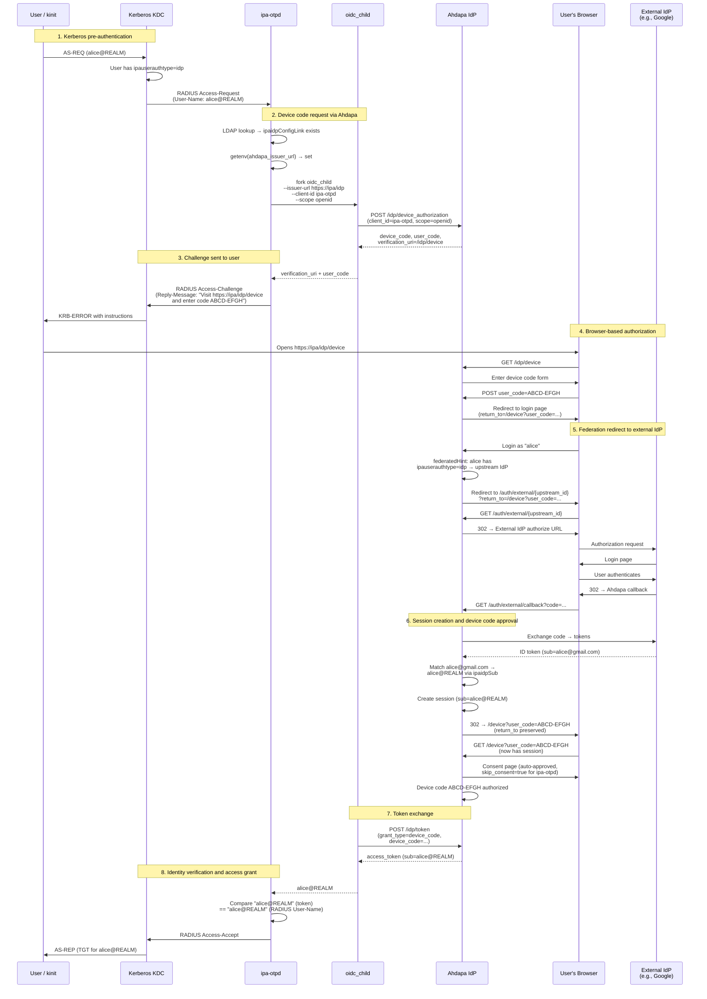

# FreeIPA Web UI login via integrated OAuth2 identity provider

## Overview

FreeIPA Web UI currently implements its own login form with support for
password, OTP, and certificate authentication. Kerberos single sign-on is
handled by Apache mod_auth_gssapi before the login form is ever shown. This
login form duplicates authentication logic that an integrated OAuth2/OIDC
identity provider already implements more comprehensively.

[Ahdapa](https://codeberg.org/freeipa/ahdapa) is an OAuth2/OIDC identity
provider purpose-built for FreeIPA environments. When co-deployed on the same
host as FreeIPA, it authenticates users against the same LDAP and KDC backends
and supports Kerberos SPNEGO, password, OTP, passkeys (FIDO2/WebAuthn),
and federated login through external identity providers configured in IPA.

This design proposes two changes:

1. **Installer integration**: FreeIPA server installation gains the ability to
   deploy, configure, and manage Ahdapa instance as a co-located service,
   following the same patterns used for ipa-custodia.

2. **Web UI authentication redirect**: Instead of showing its own login form,
   the IPA Web UI redirects unauthenticated users to Ahdapa's OAuth2
   authorization endpoint. After successful authentication, Ahdapa redirects
   back to the IPA Web UI with an authorization code. A new server-side
   endpoint exchanges the code for tokens and establishes a standard IPA
   session.

Both the Classic UI (Dojo/PatternFly at `/ipa/ui/`) and the Modern UI
(React at `/ipa/modern-ui/`) benefit from the same backend changes.

### Background

The existing [external identity provider](external-idp/external-idp.md) design
addresses OAuth 2.0 Device Authorization Grant for Kerberos- and SSSD-based
logins on IPA-enrolled machines. That design uses SSSD as the OAuth2 client and
the KDC as the token verifier. The current proposal is complementary: it
addresses browser-based Web UI authentication using the standard Authorization
Code flow with PKCE, with Ahdapa serving as both the authorization server and
authentication frontend.

## Use Cases

### UC1: User without Kerberos ticket accesses IPA Web UI

A user opens `https://ipa.example.com/ipa/ui/` in a browser without a valid
Kerberos ticket. Instead of seeing IPA's built-in login form, the browser is
redirected to Ahdapa's login page at `https://ipa.example.com/idp/authorize`.
The user authenticates using any method Ahdapa supports (password, OTP,
passkey, or federated identity). Upon success, the browser redirects back to
the IPA Web UI with a valid session, and the user can manage IPA resources.

### UC2: User with Kerberos ticket gets seamless SSO

A domain user with a valid Kerberos ticket opens the IPA Web UI. Apache
`mod_auth_gssapi` negotiates credentials via SPNEGO and establishes the IPA
session before the Web UI JavaScript loads. The OAuth2 redirect never triggers.
This behavior is unchanged from the current implementation.

### UC3: Ahdapa is deployed automatically during IPA server installation

`ipa-server-install` deploys Ahdapa by default alongside the other IPA
services. The installer creates the system user, deploys configuration files,
sets up gssproxy, configures the Apache reverse proxy, creates IPA permissions
and roles, installs the SELinux policy, and registers IPA as an OIDC client.
On replicas, `ipa-replica-install` performs the same steps. Administrators can
opt out with `--no-idp` if Ahdapa is not desired. Note that in case Ahdapa is
not co-deployed, login to this replica's Web UI will only be possible with
password and OTP via the traditional login page.

### UC4: Administrator adds Ahdapa to an existing IPA deployment

On an existing IPA server that was installed with `--no-idp`, the
administrator runs `ipa-idp-install` to deploy Ahdapa instance. The tool
performs the same configuration steps as a fresh installation.

### UC5: Multi-node topology with Ahdapa

Ahdapa instances to be deployed on all IPA replicas. Each instance discovers
peers via the IPA replication topology and synchronizes state through a gossip
protocol. All nodes use the same issuer URL (typically
`https://ipa-ca.example.com/idp`) so tokens are valid cluster-wide.

## How to Use

### Default installation

Ahdapa instance is deployed automatically during server and replica installation.
No additional flags are needed:

```bash
ipa-server-install \
    --realm EXAMPLE.COM \
    --domain example.com \
    ...
```

To skip Ahdapa deployment:

```bash
ipa-server-install --no-idp ...
ipa-replica-install --no-idp ...
```

### Installing Ahdapa on an existing server

If the server was installed with `--no-idp`, Ahdapa instance can be added
later:

```bash
ipa-idp-install
```

### Removing Ahdapa

```bash
ipa-idp-uninstall
```

### Using the Web UI with OAuth2 login

Once Ahdapa is deployed, the Web UI automatically detects its presence and
redirects unauthenticated users to Ahdapa. No additional configuration is
needed.

1. Open `https://ipa.example.com/ipa/ui/` (or `/ipa/modern-ui/`)
2. If no Kerberos ticket is available, the browser is redirected to Ahdapa
3. Authenticate on the Ahdapa login page
4. After successful authentication, the browser returns to the IPA Web UI
   with an active session

## Design

### Architecture overview



### Part 1: Installer integration

Ahdapa instance installation follows the pattern established by ipa-custodia: a
service instance class manages the deployment lifecycle.

#### Service registration

A new entry in `ipaserver/masters.py`:

```python
service_definition('ahdapa', 42, 'IDP'),
```

Start order 42 places ahdapa after custodia (41) and before the CA (50). The
service entry name `IDP` is used in LDAP under
`cn=IDP,cn=<hostname>,cn=masters,cn=ipa,cn=etc,<suffix>`.

#### File paths

New entries in `ipaplatform/base/paths.py`:

| Constant | Value |
|----------|-------|
| `AHDAPA_CONF_DIR` | `/etc/ahdapa` |
| `AHDAPA_CONF` | `/etc/ahdapa/ahdapa.toml` |
| `AHDAPA_STATE_DIR` | `/var/lib/ahdapa` |
| `AHDAPA_SOCKET_DIR` | `/run/ahdapa` |
| `AHDAPA_SOCKET` | `/run/ahdapa/ahdapa.sock` |
| `AHDAPA_CCACHE` | `/run/ahdapa/ahdapa.ccache` |
| `AHDAPA_GSSPROXY_CONF` | `/etc/gssproxy/20-ahdapa.conf` |
| `HTTPD_IPA_IDP_PROXY_CONF` | `/etc/httpd/conf.d/ipa-idp-proxy.conf` |

#### Configuration files deployed

**1. `/etc/ahdapa/ahdapa.toml`** (owner: ahdapa:ahdapa, mode: 0640)

Main server configuration with sections for:
- `[server]`: issuer URL, realm, display name, Unix socket listener
- `[db]`: SQLite database URL (default: `sqlite:///var/lib/ahdapa/ahdapa.db`)
- `[gssapi]`: gssproxy integration, service principal, S4U2Self
- `[ipa]`: LDAP URI (`ldapi://`), passkey RP ID, cache TTL
- `[tokens]`: token lifetimes (access 15m, refresh 8h, session 10h)
- `[gossip]`: IPA topology-based peer discovery
- `[[rbac.role]]` and `[[rbac.group_role]]`: RBAC mapping from IPA groups

Template: `install/share/ahdapa.toml.template`

**2. `/etc/gssproxy/20-ahdapa.conf`** (owner: root:root, mode: 0644)

Grants `ahdapa` process access to the HTTP service keytab with S4U2Self and
S4U2Proxy capabilities:

```ini
[service/ahdapa]
  mechs = krb5
  cred_store = keytab:$HTTP_KEYTAB
  cred_store = client_keytab:$HTTP_KEYTAB
  allow_protocol_transition = true
  cred_usage = both
  euid = ahdapa
```

Template: `install/share/ahdapa-gssproxy.conf.template`

**3. `/etc/httpd/conf.d/ipa-idp-proxy.conf`** (owner: root:root, mode: 0644)

Apache reverse proxy configuration routing `/idp/*` to Ahdapa's Unix socket:

```apache
ProxyPass /idp/ unix:$AHDAPA_SOCKET|http://localhost/ nocanon
ProxyPassReverse /idp/ http://localhost/
ProxyPassReverseCookiePath / /idp/
ProxyPreserveHost On
RequestHeader set X-Forwarded-Proto "https"
```

Template: `install/share/ipa-idp-proxy.conf.template`

#### System user and directories

The installer creates the `ahdapa` system user and sets up runtime
directories:

| Path | Owner | Mode | Purpose |
|------|-------|------|---------|
| `/etc/ahdapa/` | ahdapa:ahdapa | 0755 | Configuration |
| `/var/lib/ahdapa/` | ahdapa:ahdapa | 0750 | Database |
| `/run/ahdapa/` | ahdapa:apache | 2750 | Unix socket |

The `/run/ahdapa/` directory uses setgid to apache so the socket inherits
group ownership, allowing Apache mod_proxy to connect.

#### IPA permissions, privileges, and roles

The installer creates the following LDAP entries:

**Custom permission:**
- `Ahdapa - Read user IdP attributes`: read, search, compare access to
  `ipauserauthtype`, `ipaidpconfiglink`, `ipaidpsub` on user objects

**Privileges:**
- `Ahdapa Topology Read`: grants `System: Read Topology Segments`
- `Ahdapa IdP Read`: grants the custom permission above plus
  `System: Read External IdP server`

**Role:**
- `Ahdapa Services`: assigned both privileges above. The HTTP service
  principal (`HTTP/<hostname>@REALM`) is added as a member.

**LDAP indexes:**
- Equality indexes on `ipaIdpConfigLink` and `ipaIdpSub` attributes for
  efficient federated user resolution.

#### SELinux policy

Ahdapa requires a custom SELinux policy module defining:
- `ahdapa_t` domain with `ahdapa_exec_t` entrypoint
- File contexts for configuration (`ahdapa_conf_t`), state
  (`ahdapa_var_lib_t`), and runtime (`ahdapa_var_run_t`)
- Network access to LDAP (389), Kerberos (88), and HTTP (443) ports
- Unix socket access from `httpd_t` for the reverse proxy
- GSSAPI keyring operations for gssproxy integration

The policy module is installed via `semodule -i ahdapa.pp`.

#### OIDC client registration

During installation, the installer registers the IPA Web UI as an OAuth2
client in Ahdapa:

```json
{
    "client_name": "FreeIPA Web UI",
    "client_id": "ipa-webui",
    "redirect_uris": [
        "https://<hostname>/ipa/ui/",
        "https://<hostname>/ipa/modern-ui/"
    ],
    "token_endpoint_auth_method": "none",
    "grant_types": ["authorization_code"],
    "response_types": ["code"],
    "require_pkce": true
}
```

This is a public client (no secret) because the authorization code exchange
is performed server-side by the IPA WSGI handler. PKCE is mandatory.

#### Installer class

New file `ipaserver/install/ahdapainstance.py` implementing `AhdapaInstance`,
modeled after `CustodiaInstance`:

```python
class AhdapaInstance(service.SimpleServiceInstance):
    def __init__(self, fstore=None):
        super().__init__("ahdapa", service_desc="ahdapa IdP")

    def create_instance(self, realm, host_name, domain, ...):
        self.step("creating ahdapa user", self.__create_user)
        self.step("creating directories", self.__create_dirs)
        self.step("configuring ahdapa", self.__configure)
        self.step("configuring gssproxy for ahdapa",
                  self.__configure_gssproxy)
        self.step("configuring httpd proxy for ahdapa",
                  self.__configure_httpd_proxy)
        self.step("installing SELinux policy", self.__install_selinux)
        self.step("creating IPA permissions", self.__create_permissions)
        self.step("registering OIDC client", self.__register_client)
        self.step("starting ahdapa", self.__start)
        self.step("reloading httpd", self.__reload_httpd)
        self.step("restarting gssproxy", self.__restart_gssproxy)
        self.start_creation()
```

#### Uninstallation

`ipa-idp-uninstall` reverses the installation:
- Stops and disables ahdapa service
- Removes configuration files (restoring backups via `fstore`)
- Removes LDAP service entry from cn=masters
- Removes IPA permissions, privileges, and role
- Removes Apache proxy configuration and reloads httpd
- Removes gssproxy configuration and restarts gssproxy
- Optionally removes the database and system user

### Part 2: Web UI OAuth2 authentication flow

#### OAuth2 flow selection

The implementation uses the **OAuth 2.0 Authorization Code flow with PKCE**
(RFC 7636, RFC 6749). This is the recommended flow for browser-based
applications per current best practices.

The alternative of using mod_auth_openidc at the Apache layer was rejected
because:
- It would conflict with the existing mod_auth_gssapi configuration that
  protects `/ipa` with Kerberos sessions and impersonation
- It cannot bridge OIDC tokens to Kerberos ccaches (needed for IPA's LDAP
  backend)
- It would introduce a new Apache module dependency

#### New server endpoint: `login_oidc`

A new WSGI handler class `login_oidc` is added to `ipaserver/rpcserver.py`,
following the same pattern as `login_password` (line 1028).

The handler serves two functions on the same mount point:

**GET `/ipa/session/login_oidc`** — returns OIDC configuration:

```json
{
    "authorization_endpoint": "https://ipa.example.com/idp/authorize",
    "client_id": "ipa-webui",
    "redirect_uri": "https://ipa.example.com/ipa/ui/",
    "scopes": "openid profile"
}
```

Returns 404 if ahdapa is not configured, allowing the UI to detect
availability.

**POST `/ipa/session/login_oidc`** — handles the authorization code exchange:

1. **Receive** `code`, `code_verifier`, `state`, `redirect_uri` from the
   request body
2. **Exchange** the authorization code for tokens via a server-to-server POST
   to Ahdapa's token endpoint. Since Ahdapa runs on the same host, this is a
   localhost request (or a Unix socket request to
   `/run/ahdapa/ahdapa.sock`). The request includes:
   - `grant_type=authorization_code`
   - `code=<authorization code>`
   - `redirect_uri=<must match what was used in authorize>`
   - `client_id=ipa-webui`
   - `code_verifier=<PKCE verifier from browser>`
3. **Validate** the ID token: verify JWT signature against Ahdapa's JWKS,
   check `iss`, `aud`, `exp`, `nonce`
4. **Extract** the username from the `sub` claim (the Kerberos principal or
   IPA username)
5. **Obtain Kerberos ccache via S4U2Self**: use the `gssapi` Python library
   with protocol transition to impersonate the authenticated user. The HTTP
   service principal is already authorized for S4U2Self via gssproxy
   (`allow_protocol_transition = true`)
6. **Finalize session**: call `self.finalize_kerberos_acquisition()` which
   connects back to `http://localhost/ipa/session/cookie` using the
   impersonated ccache. `mod_auth_gssapi` issues a standard `ipa_session`
   cookie.
7. **Return** the `IPASESSION` cookie in the response headers

#### Apache configuration

Add location exemption for the OIDC endpoint in `ipa.conf.template`:

```apache
# Turn off Apache authentication for OIDC login
<Location "/ipa/session/login_oidc">
  Satisfy Any
  Require all granted
</Location>
```

This follows the same pattern as the existing exemptions for
`/ipa/session/login_password` (lines 112-115) and
`/ipa/session/change_password` (lines 142-145).

#### Classic UI JavaScript changes

**`install/ui/src/freeipa/ipa.js`** — new functions:

`IPA.login_oidc()`:
1. Fetch OIDC configuration from `GET /ipa/session/login_oidc`
2. Generate PKCE `code_verifier` (random 43-128 character string) and
   `code_challenge` (SHA-256 hash, base64url-encoded) using the Web Crypto API
3. Generate a random `state` parameter
4. Store `code_verifier` and `state` in `window.sessionStorage`
5. Redirect the browser to the authorization endpoint:
   ```
   /idp/authorize?response_type=code
     &client_id=ipa-webui
     &redirect_uri=https://<host>/ipa/ui/
     &scope=openid+profile
     &state=<random>
     &code_challenge=<S256 challenge>
     &code_challenge_method=S256
   ```

`IPA.complete_oidc_login(code, state)`:
1. Retrieve `code_verifier` and expected `state` from `sessionStorage`
2. Verify `state` matches
3. POST to `/ipa/session/login_oidc` with `code`, `code_verifier`, `state`,
   and `redirect_uri`
4. On success: set authenticated state, emit `logged_in`
5. Clean up `sessionStorage` and URL query parameters

**`install/ui/src/freeipa/widgets/LoginScreen.js`** — modifications:

- Add a "Log in with Single Sign-On" button in `render_buttons()`
- Add `login_with_oidc()` method that calls `IPA.login_oidc()`
- The button is conditionally displayed based on whether
  `GET /ipa/session/login_oidc` returns 200

**`install/ui/src/freeipa/app.js`** (or `app_container.js`) — modifications:

- During SPA initialization, before showing the login screen, check if the URL
  contains `code` and `state` query parameters
- If present, call `IPA.complete_oidc_login()` to exchange the code
- Strip the query parameters from the URL after processing

#### Modern UI changes

The Modern UI (React SPA at `/ipa/modern-ui/`) applies the same pattern:
- Check for OIDC callback parameters on mount
- Add OIDC login button to the login page
- Use the same `/ipa/session/login_oidc` backend endpoint

Since the Modern UI is maintained in a separate git repository
(`freeipa-webui`), those changes are tracked separately but share the same
backend.

#### Session management

Sessions established via OAuth2 login use the same `ipa_session` cookie and
mod_session infrastructure as all other authentication methods. The session
lifetime is governed by Apache's `SessionMaxAge` directive, not by the OAuth2
token lifetimes.

Ahdapa maintains its own session cookie (`session`, scoped to `/idp/`) which
is independent of the IPA session. This means:
- Logging out of IPA (clearing `ipa_session`) does not log out of Ahdapa
- If the user clicks "Log in with SSO" again after an IPA logout, Ahdapa may
  still have a valid session and authenticate them without prompting

For full logout, the IPA logout handler can optionally redirect to Ahdapa's
end_session endpoint. This is not required for the initial implementation.

### Part 3: Device Authorization Grant via Ahdapa

The existing [external identity provider](external-idp/external-idp.md) design
uses the OAuth 2.0 Device Authorization Grant (RFC 8628) flow for Kerberos
pre-authentication. When a user is configured with `ipauserauthtype=idp`, the
KDC sends a RADIUS request to `ipa-otpd`, which forks SSSD's `oidc_child` to
drive the device code flow against the IdP endpoints stored in the user's
`ipaidpConfigLink` LDAP entry.

Without Ahdapa, `oidc_child` contacts external IdP endpoints directly. The
user sees an external URL (e.g., `https://accounts.google.com/device`) and
must navigate there to complete authentication. With Ahdapa co-deployed,
`ipa-otpd` routes the device flow through Ahdapa instead. The user sees a
local URL (`https://ipa.example.com/idp/device`) and Ahdapa handles the
upstream IdP redirect transparently via its federation module.

#### Environment variable contract

The routing decision is made via the `ahdapa_issuer_url` environment variable.
The installer writes this to `/etc/ipa/default.conf`:

```ini
[global]
...
ahdapa_issuer_url = https://ipa.example.com/idp
```

The `ipa-otpd` systemd unit already reads this file via
`EnvironmentFile=/etc/ipa/default.conf`. Systemd's EnvironmentFile parser
ignores INI section headers (`[global]`) and comment lines, extracting
`KEY=VALUE` pairs. This mechanism is already used for `ldap_uri` in the
existing `ExecStart` line.

At runtime, `ipa-otpd` calls `getenv("ahdapa_issuer_url")`. If non-NULL,
the Ahdapa path is taken; otherwise the existing LDAP-based endpoint logic
is unchanged.

#### OIDC client registration for ipa-otpd

A second OAuth2 client is registered in Ahdapa for the device code flow:

```toml
[[client]]
client_id                  = "ipa-otpd"
client_name                = "FreeIPA OTP Daemon"
token_endpoint_auth_method = "none"
scopes                     = ["openid"]
grant_types                = ["urn:ietf:params:oauth:grant-type:device_code"]
skip_consent               = true
```

Key differences from the Web UI client:
- **Public client** (`token_endpoint_auth_method = "none"`): `oidc_child` does
  not send a client secret
- **Device code grant only**: no redirect URIs (RFC 8628 does not use them)
- **Minimal scope**: `openid` only — the daemon needs the `sub` claim, not
  profile data or Kerberos ccache tokens
- **Consent skipped**: the user already consents by entering the device code in
  the browser; a second consent screen would be redundant

#### oidc_child argument override

When `ahdapa_issuer_url` is set, `ipa-otpd` passes a minimal argument set to
`oidc_child`:

| Ahdapa path | Non-Ahdapa path |
|-------------|-----------------|
| `--issuer-url <ahdapa_issuer_url>` | `--issuer-url <ipaidpIssuerURL>` or individual endpoint args |
| `--client-id ipa-otpd` | `--client-id <ipaidpClientID>` |
| `--scope openid` | `--scope <ipaidpScope>` (if set) |
| *(no secret)* | `--client-secret-stdin` (if `ipaidpClientSecret` set) |
| *(no user-identifier-attribute)* | `--user-identifier-attribute <attr>` (if set) |

The `--device-code-url`, `--token-url`, and `--userinfo-url` arguments are
not needed in the Ahdapa path because `--issuer-url` causes `oidc_child` to
discover them via `.well-known/openid-configuration`.

#### Identity comparison

In the non-Ahdapa path, the access token reply from `oidc_child` is compared
against `ipaidpSub` from the user's LDAP entry. This is the
administrator-configured mapping (e.g., `alice@gmail.com`) that matches what
the external IdP returns as the user identifier claim.

In the Ahdapa path, the comparison target changes: Ahdapa returns the
Kerberos principal (e.g., `alice@EXAMPLE.COM`) as the `sub` claim. This is
compared against the RADIUS `User-Name` attribute from the incoming KDC
request, which is also the Kerberos principal. The match is exact
(case-sensitive, byte-for-byte).

This design removes the need for an LDAP round-trip to fetch `ipaidpSub` in
the Ahdapa path — the expected identity is already present in the RADIUS
packet.

#### End-to-end flow: external IdP authentication via Ahdapa

The following diagram shows the complete device authorization flow when a user
configured with an external IdP (e.g., Google) authenticates via Kerberos, and
Ahdapa is co-deployed.



#### Comparison with direct external IdP flow

| Aspect | Direct (no Ahdapa) | Via Ahdapa |
|--------|-------------------|------------|
| Device code URL shown to user | External IdP URL | Local IPA URL (`/idp/device`) |
| `oidc_child` contacts | External IdP directly | Local Ahdapa instance |
| Client credentials | From LDAP (`ipaidpClientID`, `ipaidpClientSecret`) | Hardcoded (`ipa-otpd`, no secret) |
| Identity claim | Matched against `ipaidpSub` from LDAP | Matched against RADIUS User-Name |
| Federation to external IdP | N/A (direct) | Handled by Ahdapa's federation module |
| Requires `ipaidpConfigLink` | Yes (for endpoint discovery) | Yes (Ahdapa uses it for federation target) |
| Works without internet on IPA server | No (needs IdP endpoints) | Partially (Ahdapa runs locally; browser needs internet for external IdP) |

#### Installer changes for device authorization support

The `AhdapaInstance` class handles the `ahdapa_issuer_url` configuration:

- **`create_instance()`**: adds a step `"configuring ahdapa issuer URL in
  default.conf"` that calls `_configure_default_conf()`. This writes
  `ahdapa_issuer_url = https://<fqdn>/idp` to the `[global]` section of
  `/etc/ipa/default.conf` using `RawConfigParser`. The file is backed up
  via `fstore` before modification.

- **`upgrade_instance()`**: calls `_configure_default_conf()` in the normal
  upgrade path to ensure the setting exists after upgrades.

- **`uninstall()`**: calls `_unconfigure_default_conf()` to remove the
  `ahdapa_issuer_url` option from `default.conf`.

The `ipa-otpd` service does not need an explicit restart after the URL is
written because it is started (or restarted) as part of the overall IPA
service lifecycle after installation completes.

### Security considerations

**PKCE is mandatory.** The authorization code flow uses PKCE with S256. The
code_verifier is generated in the browser, stored in `sessionStorage`, and
sent only to the IPA backend (never to the authorization server directly). The
IPA backend includes it in the server-to-server token exchange.

**State parameter.** A random state value protects against CSRF. It is
generated by JavaScript, stored in `sessionStorage`, and validated when the
callback arrives.

**Token validation.** The ID token is validated server-side in Python:
signature verification against Ahdapa's JWKS, issuer, audience, and expiry
checks.

**No tokens in the browser.** The browser never receives or stores OAuth2
access tokens. It only handles the authorization code transiently. After the
code exchange, the browser receives an `ipa_session` cookie.

**Localhost token exchange.** The code-for-tokens exchange is a server-to-server
request on the same host. No OAuth2 tokens traverse the network between IPA
and Ahdapa.

**S4U2Self authorization.** Protocol transition (S4U2Self) is already
configured for the HTTP service via gssproxy
(`allow_protocol_transition = true`). The same mechanism is used by
`mod_auth_gssapi` for x509 login. The difference is that the trigger for
impersonation is an OIDC token rather than a client certificate — but the
identity verification occurs at the OIDC layer (token signature and claims
validation).

**Referer checking.** The existing `check_referer()` method in `HTTP_Status`
validates that requests originate from `https://<ipa_host>/ipa/`. Since the
code exchange POST comes from the UI JavaScript (running on `/ipa/ui/`), the
referer check passes.

## Implementation

### New files

| File | Purpose |
|------|---------|
| `ipaserver/install/ahdapainstance.py` | Installer class for ahdapa service |
| `install/share/ahdapa.toml.template` | ahdapa main configuration template |
| `install/share/ahdapa-clients.toml.template` | OIDC client registration template (Web UI + ipa-otpd) |
| `install/share/ahdapa-gssproxy.conf.template` | gssproxy drop-in template |
| `install/share/ipa-idp-proxy.conf.template` | Apache reverse proxy template |
| `install/updates/78-ahdapa.update` | LDAP update for ahdapa container |

### Modified files

| File | Change |
|------|--------|
| `ipaserver/masters.py` | Add `service_definition('ahdapa', 42, 'IDP')` |
| `ipaplatform/base/paths.py` | Add ahdapa file path constants |
| `ipaserver/rpcserver.py` | Add `login_oidc` WSGI handler class |
| `install/share/ipa.conf.template` | Add Location exemption for login_oidc |
| `install/ui/src/freeipa/ipa.js` | Add `login_oidc()` and `complete_oidc_login()` |
| `install/ui/src/freeipa/widgets/LoginScreen.js` | Add SSO login button |
| `install/ui/src/freeipa/app.js` | Handle OIDC callback on init |
| `ipaserver/install/server/install.py` | Call `AhdapaInstance.create_instance()` |
| `daemons/ipa-otpd/oauth2.c` | Route device flow through Ahdapa when `ahdapa_issuer_url` is set |

### Dependencies

- **ahdapa package**: must be available in the OS repositories. No new Python
  dependencies are introduced to FreeIPA itself. The ahdapa binary and its
  Web UI assets are provided by the ahdapa RPM package.
- **No new Apache modules**: mod_proxy (already available) handles the reverse
  proxy. mod_auth_openidc is not required.
- **SELinux policy module**: shipped with the ahdapa package or separately
  installable.

### Backup and Restore

The following files are backed up during installation and restored on
uninstall:
- `/etc/httpd/conf.d/ipa-idp-proxy.conf`
- `/etc/gssproxy/20-ahdapa.conf`
- `/etc/ahdapa/ahdapa.toml`

The ahdapa database (`/var/lib/ahdapa/ahdapa.db`) should be included in
IPA backup (`ipa-backup`) when Ahdapa is deployed.

## Feature Management

### UI

Both Web UIs gain a "Log in with Single Sign-On" button on the login screen.
The button appears only when ahdapa is deployed and the
`GET /ipa/session/login_oidc` endpoint returns 200.

When `--webui-auth-type=idp` is configured, the login form is bypassed
entirely and the user is redirected to ahdapa automatically.

### CLI

| Command | Options |
|---------|---------|
| `ipa-server-install` | `--no-idp` — skip ahdapa deployment (deployed by default) |
| `ipa-replica-install` | `--no-idp` — skip ahdapa deployment (deployed by default) |
| `ipa-idp-install` | (no options) — deploy ahdapa on an existing server |
| `ipa-idp-uninstall` | (no options) — remove ahdapa from a server |

### Configuration

No additional LDAP configuration is required. The Web UI detects Ahdapa
availability by probing the `GET /ipa/session/login_oidc` endpoint. If Ahdapa
is deployed, the endpoint returns OIDC configuration and the UI redirects
to ahdapa automatically. If ahdapa is not deployed, the endpoint returns 404
and the UI falls back to the built-in login form.

## Upgrade

When upgrading an IPA server that already has Ahdapa deployed:

1. The Apache configuration template version is incremented (VERSION line in
   `ipa.conf.template`). The upgrade process regenerates `ipa.conf` from the
   template, adding the `login_oidc` location exemption.

2. The LDAP update file `78-ahdapa.update` is idempotent — it creates entries
   only if they do not already exist.

3. If Ahdapa was deployed manually (not through the IPA installer), the
   administrator should run `ipa-idp-install` to register the service in LDAP
   and create the required permissions.

## Test plan

### Unit tests

- `login_oidc` handler: test code exchange with mocked Ahdapa token endpoint,
  ID token validation, error handling for invalid/expired tokens
- PKCE challenge generation and verification

### Integration tests

1. **OIDC login flow**: deploy IPA (Ahdapa included by default), open Web UI, verify
   redirect to Ahdapa, authenticate with password, verify session is
   established, verify IPA RPC calls succeed

2. **Kerberos SSO preserved**: with valid Kerberos ticket, verify the user is
   authenticated via SPNEGO without seeing the Ahdapa login page

3. **Password fallback**: verify the built-in password login form still works
   when Ahdapa is not deployed (--no-idp)

4. **Multi-replica**: deploy Ahdapa on two replicas, verify a session
   obtained from one replica is valid on the other

5. **Device authorization via Ahdapa**: configure a user with
   `ipauserauthtype=idp` and an external IdP, verify that `kinit` shows a
   local Ahdapa URL (`/idp/device`) instead of the external IdP URL, complete
   the flow through Ahdapa's federation redirect, verify `kinit` succeeds

6. **Device authorization without Ahdapa**: on a server installed with
   `--no-idp`, verify the external IdP flow is unchanged — `oidc_child`
   contacts the external IdP directly using LDAP-stored endpoints

7. **Install/uninstall**: verify `ipa-idp-install` and `ipa-idp-uninstall`
   correctly deploy and remove all configuration files, LDAP entries, and
   services. Verify `ahdapa_issuer_url` is added to and removed from
   `/etc/ipa/default.conf`

8. **Upgrade**: verify that upgrading from a version without this feature
   does not break existing authentication

## Troubleshooting and debugging

### Checking ahdapa status

```bash
systemctl status ahdapa
journalctl -u ahdapa -f
```

### Verifying OIDC discovery

```bash
curl -s https://ipa.example.com/idp/.well-known/openid-configuration | python3 -m json.tool
```

### Verifying the IPA OIDC endpoint

```bash
curl -s https://ipa.example.com/ipa/session/login_oidc
```

Returns JSON with authorization endpoint configuration if Ahdapa is
deployed, or 404 if not.

### Common issues

**Login redirect fails with "invalid_client":**
The IPA Web UI client (`ipa-webui`) is not registered in Ahdapa. Run
`ipa-idp-install` or check the OIDC client registration.

**Code exchange fails with "invalid_grant":**
The authorization code has expired (default: 60 seconds) or the `code_verifier`
does not match the `code_challenge`. Check browser `sessionStorage` for stale
PKCE state.

**Session not established after redirect:**
The S4U2Self operation failed. Check gssproxy configuration:
```bash
journalctl -u gssproxy -f
```
Verify `/etc/gssproxy/20-ahdapa.conf` has `allow_protocol_transition = true`.

**502 Bad Gateway on `/idp/` paths:**
Apache cannot connect to ahdapa's Unix socket. Verify:
```bash
ls -la /run/ahdapa/ahdapa.sock
# Should be: srw-rw---- ahdapa apache
```

**ahdapa cannot access LDAP:**
Check GSSAPI authentication to the local Directory Server:
```bash
KRB5CCNAME=/run/ahdapa/ahdapa.ccache ldapsearch -Y GSSAPI -b "" -s base
```

### Log locations

| Component | Log |
|-----------|-----|
| ahdapa | `journalctl -u ahdapa` |
| Apache (proxy) | `/var/log/httpd/error_log` |
| gssproxy | `journalctl -u gssproxy` |
| IPA WSGI | `/var/log/httpd/error_log` (mod_wsgi stderr) |
| Kerberos (KDC) | `journalctl -u krb5kdc` |
