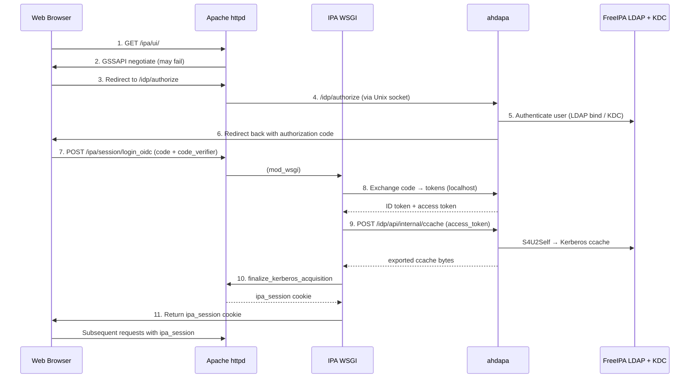

# FreeIPA Web UI login via integrated OAuth2 identity provider

## Overview

FreeIPA Web UI currently implements its own login form with support for
password, OTP, and certificate authentication. Kerberos single sign-on is
handled by Apache mod_auth_gssapi before the login form is ever shown. This
login form duplicates authentication logic that an integrated OAuth2/OIDC
identity provider already implements more comprehensively.

[Ahdapa](https://codeberg.org/freeipa/ahdapa) is an OAuth2/OIDC identity
provider purpose-built for FreeIPA environments. When co-deployed on the same
host as FreeIPA, it authenticates users against the same LDAP and KDC backends
and supports Kerberos SPNEGO, password, OTP, passkeys (FIDO2/WebAuthn),
and federated login through external identity providers configured in IPA.

This design proposes two changes:

1. **Installer integration**: FreeIPA server installation gains the ability to
   deploy, configure, and manage Ahdapa instance as a co-located service,
   following the same patterns used for ipa-custodia.

2. **Web UI authentication redirect**: Instead of showing its own login form,
   the IPA Web UI redirects unauthenticated users to Ahdapa's OAuth2
   authorization endpoint. After successful authentication, Ahdapa redirects
   back to the IPA Web UI with an authorization code. A new server-side
   endpoint exchanges the code for tokens and establishes a standard IPA
   session.

The backend changes serve both Web UIs: the Classic UI (Dojo/PatternFly at
`/ipa/ui/`) and the Modern UI (React at `/ipa/modern-ui/`) are both
registered as redirect targets of the Web UI client and both are protected
by the same session machinery. The browser-side OAuth2 redirect is
implemented in the Classic UI; the Modern UI still shows its own login
form (see [Modern UI changes](#modern-ui-changes)).

### Background

The existing [external identity provider](external-idp/external-idp.md) design
addresses OAuth 2.0 Device Authorization Grant for Kerberos- and SSSD-based
logins on IPA-enrolled machines. That design uses SSSD as the OAuth2 client and
the KDC as the token verifier. The current proposal is complementary: it
addresses browser-based Web UI authentication using the standard Authorization
Code flow with PKCE, with Ahdapa serving as both the authorization server and
authentication frontend.

That routing is a property of the deployment, not of the request: it is
switched on by the `ahdapa_issuer_url` key that the installer writes to
`/etc/ipa/default.conf` and that `ipa-otpd` picks up as an environment
variable through its systemd `EnvironmentFile`. The confirmation code
(DARC) is required by default and can be relaxed per host with
`ahdapa_darc_confirmation = off` while Kerberos clients without DARC
support remain. A verified confirmation adds the `idp-confirmed`
indicator to the ticket, and the authentication strength the IdP reports
adds `idp-mfa` (only for genuinely multi-factor sign-ins) or `idp-phr`.
Flows are not throttled per principal — the principal in an unauthenticated
AS-REQ is not proof of who is asking — but per KDC host, which is exactly
what the per-host `ipa-otpd-<fqdn>` client and Ahdapa's `auth_rate_limit`
make possible.

## Use Cases

### UC1: User without Kerberos ticket accesses IPA Web UI

A user opens `https://ipa.example.com/ipa/ui/` in a browser without a valid
Kerberos ticket. Instead of seeing IPA's built-in login form, the browser is
redirected to Ahdapa's login page at `https://ipa.example.com/idp/authorize`.
The user authenticates using any method Ahdapa supports (password, OTP,
passkey, or federated identity). Upon success, the browser redirects back to
the IPA Web UI with a valid session, and the user can manage IPA resources.

### UC2: User with Kerberos ticket gets seamless SSO

A domain user with a valid Kerberos ticket opens the IPA Web UI. Apache
`mod_auth_gssapi` negotiates credentials via SPNEGO and establishes the IPA
session before the Web UI JavaScript loads. The OAuth2 redirect never triggers.
This behavior is unchanged from the current implementation.

### UC3: Ahdapa is deployed automatically during IPA server installation

`ipa-server-install` deploys Ahdapa by default alongside the other IPA
services. The installer deploys configuration files, sets up gssproxy,
configures the Apache reverse proxy, enables S4U2Self delegation on the HTTP
service principal, adds the HTTP service principal to the `Ahdapa Services`
role so that Ahdapa may read the topology, trust and external-IdP data it
needs, registers the IPA Web UI and this host's `ipa-otpd` as static OIDC
clients, creates the key pair `ipa-otpd` uses to authenticate to Ahdapa,
routes Kerberos IdP logins through Ahdapa, and creates the HBAC rule and
`krb5:ccache` scope needed for credential exchange. The system user and the
SELinux policy for the `ahdapa` domain are provided by the ahdapa RPM
package.
On replicas, `ipa-replica-install` performs the same steps. Administrators can
opt out with `--no-idp` if Ahdapa is not desired. Note that in case Ahdapa is
not co-deployed, login to this replica's Web UI is limited to what the
traditional login form and Apache offer: Kerberos SSO, password, OTP/radius
and certificate login. Passkey and federated (external IdP) sign-in are only
available through Ahdapa.

### UC4: Administrator adds Ahdapa to an existing IPA deployment

**Not yet implemented.** On an existing IPA server that was installed with
`--no-idp`, there is currently no standalone command to deploy Ahdapa after
the fact. The `upgrade_instance()` method only re-configures Ahdapa if it
was previously installed (the `ahdapa/installed` sysupgrade flag is set).
A dedicated `ipa-idp-install` command is planned for a future iteration.

### UC5: Multi-node topology with Ahdapa

An Ahdapa instance is deployed on every IPA replica. Each instance discovers
peers from the IPA replication topology (`[gossip] ipa_topology = true`,
refreshed every 300 s) and synchronizes its state — client registrations,
HBAC rules, scopes, sessions — cluster-wide through gossip.

Each node has its own issuer, `https://<replica fqdn>/idp`, and its own
Web UI client `ipa-webui-<replica fqdn>`; tokens are issued by, and
validated against, the node that authenticated the user. `ipa-ca.$DOMAIN`
is the shared host name of the integrated IdP and is served by every IPA
server, so a request that continues a flow started elsewhere — an
authorization code exchange, a device authorization poll, a verification
page — can land on any replica. `[cluster] distributed_mode =
"forwarding"` makes those replicas forward the request to the node that
started the flow, which is the only one that can enforce single use of the
code or device code. `node_id` is pinned to the replica's FQDN because
that is the host name peers are reached at through the topology.

## How to Use

### Default installation

Ahdapa instance is deployed automatically during server and replica installation.
No additional flags are needed:

```bash
ipa-server-install \
    --realm EXAMPLE.COM \
    --domain example.com \
    ...
```

To skip Ahdapa deployment:

```bash
ipa-server-install --no-idp ...
ipa-replica-install --no-idp ...
```

### Adding Ahdapa to an existing server

If the server was installed with `--no-idp`, there is currently no
standalone command to add Ahdapa after the fact. A dedicated
`ipa-idp-install` command is planned for a future iteration.
`ipa-server-upgrade` reconfigures an Ahdapa that is already installed —
including creating the `ipa-otpd` client key and writing the DARC settings
to `/etc/ipa/default.conf` — but it does not deploy a missing one.

### Using the Web UI with OAuth2 login

Once Ahdapa is deployed, the Classic Web UI automatically detects its
presence and redirects unauthenticated users to Ahdapa. No additional
configuration is needed. (The Modern UI does not do this yet; see
[Modern UI changes](#modern-ui-changes).)

1. Open `https://ipa.example.com/ipa/ui/`
2. If no Kerberos ticket is available, the browser is redirected to Ahdapa
3. Authenticate on the Ahdapa login page
4. After successful authentication, the browser returns to the IPA Web UI
   with an active session

## Design

### Architecture overview


```mermaid
sequenceDiagram
    participant Browser as Web Browser
    participant Apache as Apache httpd
    participant IPA as IPA WSGI
    participant Ahdapa as ahdapa
    participant Backend as FreeIPA LDAP + KDC

    Browser->>Apache: 1. GET /ipa/ui/
    Apache->>Browser: 2. GSSAPI negotiate (may fail)
    Browser->>Apache: 3. Redirect to /idp/authorize
    Apache->>Ahdapa: 4. /idp/authorize (via Unix socket)
    Ahdapa->>Backend: 5. Authenticate user (LDAP bind / KDC)
    Ahdapa->>Browser: 6. Redirect back with authorization code
    Browser->>Apache: 7. POST /ipa/session/login_oidc (code + code_verifier)
    Apache->>IPA: (mod_wsgi)
    IPA->>Ahdapa: 8. Exchange code → tokens (localhost)
    Ahdapa-->>IPA: ID token + access token
    IPA->>Ahdapa: 9. POST /idp/api/internal/ccache (access_token)
    Ahdapa->>Backend: S4U2Self → Kerberos ccache
    Ahdapa-->>IPA: exported ccache bytes
    IPA->>Apache: 10. finalize_kerberos_acquisition
    Apache-->>IPA: ipa_session cookie
    IPA->>Browser: 11. Return ipa_session cookie
    Browser->>Apache: Subsequent requests with ipa_session
```

### Part 1: Installer integration

Ahdapa instance installation follows the pattern established by ipa-custodia: a
service instance class manages the deployment lifecycle.

#### Service registration

A new entry in `ipaserver/masters.py`:

```python
service_definition('ahdapa', 42, 'IDP'),
```

Start order 42 places ahdapa after custodia (41) and before the CA (50). The
service entry name `IDP` is used in LDAP under
`cn=IDP,cn=<hostname>,cn=masters,cn=ipa,cn=etc,<suffix>`.

#### File paths

New entries in `ipaplatform/base/paths.py`:

| Constant | Value |
|----------|-------|
| `AHDAPA_CONF_DIR` | `/etc/ahdapa` |
| `AHDAPA_CONF` | `/etc/ahdapa/ahdapa.toml` |
| `AHDAPA_CLIENTS_CONF` | `/etc/ahdapa/clients.toml` |
| `AHDAPA_STATE_DIR` | `/var/lib/ahdapa` |
| `AHDAPA_SOCKET_DIR` | `/run/ahdapa` |
| `AHDAPA_SOCKET` | `/run/ahdapa/ahdapa.sock` |
| `AHDAPA_CCACHE` | `/run/ahdapa/ahdapa.ccache` |
| `AHDAPA_GSSPROXY_CONF` | `/etc/gssproxy/20-ahdapa.conf` |
| `AHDAPACTL` | `/usr/bin/ahdapactl` |
| `IPA_OTPD_STATE_DIR` | `/var/lib/ipa/ipa-otpd` |
| `IPA_OTPD_AHDAPA_P12` | `/var/lib/ipa/ipa-otpd/ahdapa-client.p12` |
| `IPA_OTPD_AHDAPA_P12_PASSWORD` | `/var/lib/ipa/ipa-otpd/ahdapa-client.pwd` |
| `HTTPD_IPA_IDP_PROXY_CONF` | `/etc/httpd/conf.d/ipa-idp-proxy.conf` |

The three `IPA_OTPD_*` entries are not Ahdapa's own files: they hold the
PKCS#12 key pair the installer creates for this host's `ipa-otpd` client at
Ahdapa (see [Kerberos IdP logins through Ahdapa](#kerberos-idp-logins-through-ahdapa)).

#### Configuration files deployed

**1. `/etc/ahdapa/ahdapa.toml`** (owner: ahdapa:ahdapa, mode: 0600)

Main server configuration with sections for:
- `[server]`: issuer URL (`https://<fqdn>/idp`), `node_id` (the replica's
  FQDN, which is the host name peers are reached at), realm, display name,
  Unix socket listener, `auth_rate_limit` (300 requests per source address
  in a 5-minute window: `ipa-otpd` on this host reaches Ahdapa through
  httpd for every Kerberos IdP login — device authorization and token
  polls — so the limit bounds all IdP logins handled by this KDC. There is
  no per-principal limit in `ipa-otpd`; what protects a user is that a DARC
  flow does nothing until the approver acts on it, plus IPA's own
  lockout)
- `[db]`: SQLite database URL (`sqlite://<state dir>/ahdapa.db`), max
  connections
- `[gssapi]`: gssproxy integration, service principal, initiator principal,
  ccache path
- `[ipa]`: LDAP URI (`ldapi://`), cache TTL
- `[clients]`: path to the static client registration file
- `[webui]`: path to ahdapa's own Web UI static assets
- `[tokens]`: token lifetimes (access 15m, refresh 8h, auth code 60s,
  session 10h)
- `[device_flow]`: DARC — whether the return confirmation code is required,
  which clients are exempt from it, and the code length and charset
- `[[authorization_details.types]]` and `[[authorization_details.rules]]`:
  the RFC 9396 `krb5_tgt` detail type that only clients listed in
  `authorization_details_types` (the `ipa-otpd` client) may assert, and the
  rule restricting it to this realm
- `[cluster]`: `distributed_mode = "forwarding"` — a request that continues
  a flow another replica started is forwarded there, so only that replica
  can enforce single use of the code
- `[gossip]`: IPA topology-based peer discovery (refreshed every 300 s) and
  the gossip round interval
- `[[rbac.role]]` and `[[rbac.group_role]]`: RBAC mapping from IPA groups
  (`admins` → `admin`, `ipausers` → `viewer`)

Template: `install/share/ahdapa.toml.template`

**2. `/etc/ahdapa/clients.toml`** (owner: ahdapa:ahdapa, mode: 0600)

Static OAuth2 client registration, referenced from `ahdapa.toml` via
`[clients] file = ...`. It contains two `[[client]]` entries: this
replica's IPA Web UI client (public, authorization code grant only) and
this KDC host's `ipa-otpd` client (confidential, `private_key_jwt`, device
grant only, with its public key registered inline as `jwks`). Both are
described in [OIDC client registration](#oidc-client-registration).

Template: `install/share/ahdapa-clients.toml.template`

**3. `/etc/gssproxy/20-ahdapa.conf`** (owner: root:root, mode: 0644)

Grants `ahdapa` process access to the HTTP service keytab with S4U2Self and
S4U2Proxy capabilities:

```ini
[service/ahdapa]
  mechs = krb5
  cred_store = keytab:$HTTP_KEYTAB
  cred_store = client_keytab:$HTTP_KEYTAB
  allow_protocol_transition = true
  allow_constrained_delegation = true
  cred_usage = both
  euid = $AHDAPA_USER
```

The `$AHDAPA_USER` variable is substituted with the numeric UID of the
`ahdapa` system user at install time.

Both `allow_protocol_transition` (S4U2Self) and `allow_constrained_delegation`
(S4U2Proxy) are required: Ahdapa's self-service operations (OTP/passkey/
profile edits) act on LDAP *as the authenticated user*, not as the Ahdapa
service identity, so that 389-ds's own per-user ACIs enforce what each user
may change and Ahdapa itself is never granted broad write access to other
users' attributes.

Template: `install/share/ahdapa-gssproxy.conf.template`

**4. `/etc/httpd/conf.d/ipa-idp-proxy.conf`** (owner: root:root, mode: 0644)

Apache reverse proxy configuration routing `/idp/*` to Ahdapa's Unix socket.
Includes security headers (X-Content-Type-Options, X-Frame-Options,
Content-Security-Policy), a permanent redirect from `/idp` to `/idp/`,
and a rewrite rule to enforce HTTPS:

```apache
RedirectMatch permanent ^/idp$ /idp/

<Location "/idp/">
    AuthType None
    Require all granted

    ProxyPass        unix:$AHDAPA_SOCKET|http://ahdapa-local/  nocanon
    ProxyPassReverse http://ahdapa-local/
    ProxyPassReverseCookiePath / /idp/
    ProxyPreserveHost On

    SSLOptions +StdEnvVars +ExportCertData +StrictRequire
    SSLVerifyClient none
    RequestHeader set X-Forwarded-Proto "https"
    Header always set    X-Content-Type-Options "nosniff"
    Header always append X-Frame-Options "DENY"
    Header always append Content-Security-Policy "frame-ancestors 'none'"
</Location>

RewriteCond %{SERVER_PORT} !^443$
RewriteRule ^/idp/(.*)     https://%{HTTP_HOST}/idp/$1 [L,R=307,NC]
```

Two details of this file are load-bearing:

- `ProxyPass`/`ProxyPassReverse`/`ProxyPassReverseCookiePath` are declared
  **inside** the `<Location "/idp/">` block, not at server scope.
  mod_proxy's `Set-Cookie` path rewriting is a global, load-order-dependent
  match on the internal path alone (`/` here), and is not scoped to the
  backend that actually served the response. Ahdapa's and Akamu's proxy
  configuration files both rewrite from `/`, so at top level whichever file
  loads first would silently steal the other's cookie rewrite and break
  session cookies for one of the two services.
- The placeholder host after `|` (`http://ahdapa-local/`) is mod_proxy's
  worker-pool key, not a real destination; the actual connection is the
  `unix:` socket. It must be unique across every Unix-socket-backed
  `ProxyPass` FreeIPA configures, because of mod_proxy's long-standing
  worker-sharing bug in which two UDS workers with the same logical URL can
  have their pooled connections cross-contaminated and route a request to
  the wrong backend socket.

Template: `install/share/ipa-idp-proxy.conf.template`

#### System user and directories

The `ahdapa` system user and runtime directories are created by the ahdapa
RPM package. The installer verifies that the user exists (via
`_get_ahdapa_user()`) and sets ownership on the configuration directory:

| Path | Owner | Mode | Purpose |
|------|-------|------|---------|
| `/etc/ahdapa/` | ahdapa:ahdapa | 0755 | Configuration |
| `/etc/ahdapa/ahdapa.toml` | ahdapa:ahdapa | 0600 | Main config |
| `/etc/ahdapa/clients.toml` | ahdapa:ahdapa | 0600 | Client registration |

#### LDAP container

The installer creates an LDAP container `cn=ahdapa,cn=ipa,cn=etc,<suffix>`
via the update file `install/updates/78-ahdapa.update`. This is an
idempotent operation that creates the entry only if it does not already
exist.

The same update file provisions the LDAP side of Ahdapa's own access to IPA
data, which `[gossip] ipa_topology = true` and the external-IdP federation
require:

| Entry | Purpose |
|-------|---------|
| `cn=Ahdapa Services,cn=roles,cn=accounts,<suffix>` | role whose members are the HTTP service principals running the IdP |
| `cn=Ahdapa Topology Read,cn=privileges,cn=pbac,<suffix>` | privilege granting read access to topology segments and trust information |
| `cn=Ahdapa IdP Read,cn=privileges,cn=pbac,<suffix>` | privilege granting read access to external IdP server configuration and user IdP attributes |
| `cn=Ahdapa - Read user IdP attributes,cn=permissions,cn=pbac,<suffix>` | permission, enforced by an ACI added to `cn=users,cn=accounts,<suffix>`, for `ipauserauthtype`, `ipaidpconfiglink` and `ipaidpsub` |

The two privileges are granted membership in the existing System permissions
`System: Read Topology Segments`, `System: Read Trust Information`,
`System: Read External IdP server` and `System: Read External IdP server
client secret` — the last one because Ahdapa performs the authorization code
exchange with the external IdP itself and therefore needs the client secret,
not only the public endpoints.

Role membership is **not** created by the update file: `_grant_role_membership()`
adds this host's `HTTP/<hostname>@REALM` service principal to `Ahdapa Services`
with `role_add_member`, so hosts that do not run Ahdapa are unaffected.

#### S4U2Self delegation

The installer sets `ipakrboktoauthasdelegate=True` on the HTTP service
principal (`HTTP/<hostname>@REALM`) so that S4U2Self tickets obtained by
Ahdapa (via gssproxy and the HTTP keytab) are forwardable. This is
required for the Kerberos ccache exchange to produce usable credentials.

#### Kerberos IdP logins through Ahdapa

Beyond the browser flow, an installed Ahdapa also becomes the IdP for
Kerberos logins that use an external identity provider (PA-152 device
pre-authentication). Two installer steps do this, both in
`ipaserver/install/ahdapainstance.py`:

**`_configure_otpd_client()`** calls `ensure_credential()` in
`ipaserver/install/ahdapa_otpd.py`. It creates, once and idempotently, the
credential of this host's `ipa-otpd` client at Ahdapa: a self-signed X.509
certificate wrapping an EC P-256 key, stored as a PKCS#12 file at
`/var/lib/ipa/ipa-otpd/ahdapa-client.p12` with its password in
`ahdapa-client.pwd` (both mode 0600, directory 0700, relabelled
`ipa_otpd_key_t` via `tasks.restore_context()`). `oidc_child` reads the
PKCS#12; the public key is registered inline in `clients.toml` as the
client's `jwks`, and `private_key_jwt` (RFC 7523) is what authenticates
`ipa-otpd-<fqdn>` at the token endpoint. The certificate is valid for
`CERT_VALIDITY_DAYS` (10 years) because only the key matters: Ahdapa trusts
the registered public key, not the certificate. An existing credential is
kept across re-runs of install or upgrade, so a replica's registration on the
other nodes stays valid.

**`_configure_otpd_routing()`** writes two keys into the `[global]` section of
`/etc/ipa/default.conf` if they are not already set —
`ahdapa_issuer_url = https://<fqdn>/idp` and `ahdapa_darc_confirmation =
required` — and, if it changed anything, restarts `krb5kdc`, because
`ipa-otpd` reads `default.conf` through its systemd `EnvironmentFile` when
the KDC starts it. `daemons/ipa-otpd/oauth2.c` treats a non-empty
`ahdapa_issuer_url` as the switch to Ahdapa mode: it talks DARC to the local
Ahdapa as `ipa-otpd-<fqdn>`
(`--client-auth-method jwt`), asserts an RFC 9396 `krb5_tgt` authorization
detail describing the ticket it is asking for, asks for an alphanumeric
confirmation code and locks the verification page to the user's own principal.
The asserted detail is `{type: "krb5_tgt", realm: ..., principal: ...,
armor: "anonymous"}`: naming the requesting host and address needs MIT krb5
kdcpreauth callbacks that do not exist yet (DARC phase 2).

The routing is written only on a **new** installation: an existing deployment
switches when its external IdP registrations allow Ahdapa's redirect URIs, by
setting `ahdapa_issuer_url` in `default.conf` (see
[DARC](external-idp/darc.md)).

`daemons/ipa-otpd/oauth2.c` deliberately does not limit how many flows one
principal may start: the principal in an AS-REQ is unauthenticated input, so a
per-principal limit would let a stranger lock that user out. Volume is bounded
per KDC host instead — one client per host, and Ahdapa's per-source-address
`auth_rate_limit`.

#### HBAC rule and scope provisioning

After starting Ahdapa, the installer uses the `ahdapactl` command-line
tool to create:

- A `krb5:ccache` scope (if it does not already exist), which authorizes
  clients to request Kerberos credential exchange
- An HBAC rule named "IPA Web UI access", granting users in the
  `ipausers` group access to the `openid,profile,krb5:ccache` scopes for
  each replica's own `ipa-webui-<hostname>` client (see
  [OIDC client registration](#oidc-client-registration))

This is one shared, gossip-synced rule across the whole cluster: the first
replica to run creates it with its own client_id; every later replica's
install/upgrade adds its own client_id to the existing rule
(`ahdapactl hbac update <id> --add-clients ...`) rather than skipping past
it, since replicas do not all share a single client_id (see below).

Concretely, `_configure_hbac()` runs:

```console
ahdapactl scopes list
ahdapactl scopes update krb5:ccache --description 'Kerberos credential exchange'
ahdapactl hbac list
ahdapactl hbac create --name 'IPA Web UI access' \
    --description 'Allow all users to obtain Kerberos credentials via the FreeIPA Web UI' \
    --user-groups ipausers --clients ipa-webui-<fqdn> \
    --scopes openid,profile,krb5:ccache
# or, when the rule already exists:
ahdapactl hbac update <rule-id> --add-clients ipa-webui-<fqdn>
```

These operations are performed after Ahdapa is running because they use
Ahdapa's own API: `ahdapactl --url https://<fqdn>/idp --ca-cert
/etc/ipa/ca.crt --kerberos ...`. `--kerberos` consumes the ambient
credential cache, and `ahdapactl` needs a ticket for a principal Ahdapa's
RBAC maps to its `admin` role. During installation no one has kinit'd yet, so
`_configure_hbac()` acquires a transient ticket for the admin principal in a
private ccache (`ipautil.private_ccache()` + `kinit_password`) when it has the
admin password; on upgrade, where the password is not available, it falls back
to the ambient ccache of the `ipa-server-upgrade` process.

#### SELinux policy

The SELinux policy module for Ahdapa is shipped by the `ahdapa` RPM package,
not by FreeIPA. The FreeIPA installer does not install or manage the SELinux
policy itself. The policy defines the `ahdapa_t` domain, file contexts for
configuration, state, and runtime directories, and grants the necessary
network and Unix socket access for LDAP, Kerberos, and the httpd reverse
proxy.

FreeIPA's own policy does cover the IPA side of the same boundary:
`selinux/ipa.fc` labels `/var/lib/ipa/ipa-otpd` as `ipa_otpd_key_t` and
`selinux/ipa.te` allows only `ipa_otpd_t` and `sssd_mfa_t` (i.e.
`oidc_child`) to read it. Because `restorecon` does not recurse into that
directory, the installer relabels the directory and both files explicitly
through `ahdapa_otpd._restore_context()`.

#### OIDC client registration

The IPA Web UI OAuth2 client is registered statically via the
`/etc/ahdapa/clients.toml` configuration file, deployed from
`install/share/ahdapa-clients.toml.template`. The client ID is per-replica
(`ipa-webui-<hostname>`), computed by the `idp_client_id(fqdn)` function in
`ahdapainstance.py` and imported by `rpcserver.py` -- not a single shared
constant. Ahdapa's client store is gossip-synced cluster-wide, so a single
shared client_id would have each replica's config render overwrite the
redirect_uris the others depend on; per-host IDs let every replica register
independently without colliding.

```toml
[[client]]
client_id                  = "ipa-webui-<hostname>"
client_name                = "FreeIPA Web UI"
token_endpoint_auth_method = "none"
scopes                     = ["openid", "profile", "krb5:ccache"]
grant_types                = ["authorization_code"]
redirect_uris              = [
    "https://<hostname>/ipa/ui/",
    "https://<hostname>/ipa/modern-ui/",
]
skip_consent               = true
```

This is a public client (no secret) because the authorization code exchange
is performed server-side by the IPA WSGI handler. The `krb5:ccache` scope
authorizes the client to request Kerberos credential exchange from Ahdapa's
internal ccache endpoint. `skip_consent` is set because this is FreeIPA's
own first-party Web UI, not a third party requesting delegated access --
without it, ahdapa would show a consent screen on every single login.

The client is deliberately limited to the `authorization_code` grant: a
public client_id can be used by anyone, so it must not be able to start
device flows (consent phishing). The `ipa-otpd` client below is the one
allowed to use them.

The same file registers this KDC host's confidential `ipa-otpd` client:

```toml
[[client]]
client_id                   = "ipa-otpd-<hostname>"
client_name                 = "<REALM> KDC (<hostname>)"
token_endpoint_auth_method  = "private_key_jwt"
jwks                        = { keys = [ { ... } ] }
scopes                      = ["openid"]
grant_types                 = ["urn:ietf:params:oauth:grant-type:device_code"]
authorization_details_types = ["krb5_tgt"]
```

`jwks` is the inline JWKS of the key created by `_configure_otpd_client()`;
the client is allowed only the device grant and only the `krb5_tgt`
authorization detail type, which the verification page shows as
"Asserted by `<client_name>`". Because each KDC host has its own client,
Ahdapa can tell the hosts apart for throttling and revocation.

#### Installer class

New file `ipaserver/install/ahdapainstance.py` implementing `AhdapaInstance`,
modeled after `CustodiaInstance`. It defines `idp_client_id(fqdn)`, a
function (not a constant, since the value is per-replica) imported by
`rpcserver.py`.

```python
class AhdapaInstance(SimpleServiceInstance):
    def __init__(self, fstore=None):
        super().__init__("ahdapa")

    def configure_instance(self, realm, host_name, domain, ldap_suffix=None,
                           admin_principal=None, admin_password=None):
        self.step("creating ahdapa container",
                  self._create_container)
        self.step("enabling S4U2Self delegation on HTTP service",
                  self._enable_delegation)
        self.step("granting ahdapa service role membership",
                  self._grant_role_membership)
        self.step("creating ipa-otpd client key for ahdapa",
                  self._configure_otpd_client)
        self.step("configuring ahdapa",
                  self._configure_ahdapa)
        self.step("routing Kerberos IdP logins through ahdapa",
                  self._configure_otpd_routing)
        self.step("configuring gssproxy for ahdapa",
                  self._configure_gssproxy)
        self.step("configuring httpd proxy for ahdapa",
                  self._configure_httpd_proxy)

        super().create_instance(gensvc_name='IDP', fqdn=self.fqdn,
                               ldap_suffix=..., realm=self.realm)
        # ... SimpleServiceInstance.create_instance starts the service ...
        # httpd already has ipa-idp-proxy.conf on disk, but must not proxy
        # /idp before ahdapa is actually listening on its socket:
        ipautil.wait_for_open_socket(paths.AHDAPA_SOCKET, timeout=60)
        services.knownservices.httpd.reload_or_restart()
        # After the service is running:
        self._configure_hbac()  # krb5:ccache scope and HBAC rule
        sysupgrade.set_upgrade_state('ahdapa', 'installed', True)
```

`configure_instance()` — not `create_instance()` — is what the installers
call; `SimpleServiceInstance.create_instance()` is the base implementation it
delegates to. `_create_container` runs the `78-ahdapa.update` LDAP update.
`_enable_delegation` sets `ipakrboktoauthasdelegate=True` on the HTTP service
principal if not already set. `_grant_role_membership` adds that principal to
the `Ahdapa Services` role. `_configure_ahdapa` deploys both `ahdapa.toml` and
`clients.toml` using `_write_secure` (atomic write via `os.open` with explicit
mode 0o600 and `os.fchown`) and chowns `/etc/ahdapa` to the ahdapa user.
`_configure_hbac` runs after Ahdapa is started and uses `ahdapactl` to create
the `krb5:ccache` scope and HBAC rule.

`ipaserver/install/server/install.py` and `ipaserver/install/server/replicainstall.py`
call `configure_instance()` with `admin_principal` and `admin_password` so that
`_configure_hbac()` can obtain its own ticket, and only after the admin Kerberos
key has been created — `ahdapactl --kerberos` needs a principal Ahdapa's RBAC
maps to its `admin` role.

#### Uninstallation

The `AhdapaInstance.uninstall()` method reverses the installation:
- Stops and disables the ahdapa service (via `SimpleServiceInstance`)
- Restores or removes configuration files: `ipa-idp-proxy.conf`,
  `20-ahdapa.conf`, `clients.toml`, and `ahdapa.toml` (using `fstore`
  backup restoration or `ipautil.remove_file`)
- Removes the `ipa-otpd` client credential (`ahdapa_otpd.remove_credential()`:
  `/var/lib/ipa/ipa-otpd/ahdapa-client.p12` and `ahdapa-client.pwd`)
- Sets the upgrade state to `installed=False`

It does not remove the LDAP entries created by `78-ahdapa.update` (the
container, the `Ahdapa Services` role and its grants) and does not undo the
`ipakrboktoauthasdelegate` flag on the HTTP principal; both are re-created
idempotently if Ahdapa is configured again.

### Part 2: Web UI OAuth2 authentication flow

#### OAuth2 flow selection

The implementation uses the **OAuth 2.0 Authorization Code flow with PKCE**
(RFC 7636, RFC 6749). This is the recommended flow for browser-based
applications per current best practices.

The alternative of using mod_auth_openidc at the Apache layer was rejected
because:
- It would conflict with the existing mod_auth_gssapi configuration that
  protects `/ipa` with Kerberos sessions and impersonation
- It cannot bridge OIDC tokens to Kerberos ccaches (needed for IPA's LDAP
  backend)
- It would introduce a new Apache module dependency

#### New server endpoint: `login_oidc`

A new WSGI handler class `login_oidc` is added to `ipaserver/rpcserver.py`,
extending `Backend` and `KerberosSession`. It is registered as a plugin via
`ipaserver/plugins/xmlserver.py`.
Its `_on_finalize()` mounts the handler on the WSGI dispatcher at
`key = '/session/login_oidc'`, i.e. under the existing `/ipa` prefix.

The handler serves two functions on the same mount point:

**GET `/ipa/session/login_oidc`** — returns OIDC configuration:

```json
{
    "authorization_endpoint": "https://ipa.example.com/idp/authorize",
    "client_id": "ipa-webui-ipa.example.com",
    "redirect_uri": "https://ipa.example.com/ipa/ui/",
    "scopes": "openid profile krb5:ccache"
}
```

Availability is determined by checking whether the file
`HTTPD_IPA_IDP_PROXY_CONF` (`/etc/httpd/conf.d/ipa-idp-proxy.conf`) exists.
This file is chosen instead of `AHDAPA_CONF` because the ahdapa configuration
file has mode 0600 and is unreadable by the Apache WSGI process. Returns 404
if the proxy configuration file is absent, allowing the UI to detect
availability.

**POST `/ipa/session/login_oidc`** — handles the authorization code exchange:

1. **Receive** `code`, `code_verifier`, and `redirect_uri` from the
   request body (form-encoded). The `redirect_uri` is validated against a
   whitelist of allowed UI paths (`/ipa/ui/` and `/ipa/modern-ui/`);
   if not provided, it defaults to `/ipa/ui/`.
2. **Exchange** the authorization code for tokens via a server-to-server POST
   to Ahdapa's token endpoint (`https://<host>/idp/token`) with TLS
   verification against the IPA CA certificate. The request includes:
   - `grant_type=authorization_code`
   - `code=<authorization code>`
   - `redirect_uri=<must match what was used in authorize>`
   - `client_id=ipa-webui-<host>` (from `idp_client_id(host)`)
   - `code_verifier=<PKCE verifier from browser>`
3. **Validate** the ID token: base64url-decode the JWT payload (no
   cryptographic signature verification, since the token exchange is
   server-to-server over TLS to this same host with IPA CA verification).
   Check that `iss` matches `https://<host>/idp` and that `aud` contains
   `idp_client_id(host)` (the `aud` claim may be a string or an array).
4. **Extract** the username from the `sub` claim.
5. **Obtain Kerberos ccache via Ahdapa**: POST the `access_token` (obtained
   in step 2 with `krb5:ccache` scope) to Ahdapa's internal ccache endpoint
   (`https://<host>/idp/api/internal/ccache`) with a Bearer authorization
   header. Ahdapa performs S4U2Self on behalf of the authenticated user
   and returns exported Kerberos ccache bytes.
6. **Write ccache and finalize session**: write the exported ccache bytes to
   a temporary file in `IPA_CCACHES`, then call
   `self.finalize_kerberos_acquisition('login_oidc', ...)`, which connects
   back to `http://<host>/ipa/session/cookie` — this host's own IPA virtual
   host — authenticating with the ccache. `mod_auth_gssapi` there issues a
   standard `ipa_session` cookie; the handler reads it from the response and
   returns it as the `IPASESSION` header. The temporary ccache file is
   removed afterwards.
7. **Return** the `IPASESSION` cookie in the response headers. Failures at
   any of these steps answer 401 with an `X-IPA-Rejection-Reason` of
   `token-exchange-failed`, `invalid-token` or
   `kerberos-impersonation-failed`, which is what the UI displays.

#### Apache configuration

A location exemption for the OIDC endpoint is added to `ipa.conf.template`:

```apache
# Turn off Apache authentication for OIDC login via integrated IdP
<Location "/ipa/session/login_oidc">
  Satisfy Any
  Require all granted
</Location>
```

This follows the same pattern as the existing exemptions for
`/ipa/session/login_password` and `/ipa/session/change_password`.

#### Classic UI JavaScript changes

**`install/ui/src/freeipa/config.js`** — new config property:

- `oidc_login_url: '/ipa/session/login_oidc'` added alongside the
  existing login URL properties.

**`install/ui/src/freeipa/ipa.js`** — new functions:

`IPA.login_oidc()`:
1. Fetch OIDC configuration from `GET /ipa/session/login_oidc`
   (via `config.oidc_login_url`)
2. Generate PKCE `code_verifier` (48 random bytes, base64url-encoded) and
   `code_challenge` (SHA-256 hash, base64url-encoded) using the Web Crypto API
3. Generate a random `state` parameter (same generation method)
4. Store `code_verifier` and `state` in `window.sessionStorage` under keys
   `oidc_code_verifier` and `oidc_state`
5. Redirect the browser to the authorization endpoint:
   ```
   https://<host>/idp/authorize?response_type=code
     &client_id=ipa-webui-<host>
     &redirect_uri=https://<host>/ipa/ui/
     &scope=openid+profile+krb5%3Accache
     &state=<random>
     &code_challenge=<S256 challenge>
     &code_challenge_method=S256
   ```
6. Returns a Deferred that resolves to `'unavailable'` if the GET request
   fails (ahdapa not configured) or if the Web Crypto API fails. On
   successful redirect the Deferred is intentionally not resolved.

`IPA.complete_oidc_login(code, state)`:
1. Retrieve `code_verifier` and expected `state` from `sessionStorage`
2. Remove both items from `sessionStorage` immediately
3. If `state` does not match, resolve with `'invalid-state'`
4. If `code_verifier` is missing, resolve with `'missing-verifier'`
5. Construct `redirect_uri` from `window.location` (protocol + host + pathname)
6. POST to `/ipa/session/login_oidc` with `code`, `code_verifier`, and
   `redirect_uri` (form-encoded)
7. On success: call `auth.current.set_authenticated(true, 'oidc')`, resolve
   with `'success'`
8. On error: resolve with the `X-IPA-Rejection-Reason` header value or
   `'failed'`

`IPA.logout()`:
1. Call the existing `session_logout` JSON-RPC endpoint
2. On success or 401 response, call `POST /idp/api/auth/logout` to
   terminate the Ahdapa session before reloading the page
3. Set `sessionStorage.logout = true` so the next page load shows the
   login form

**`install/ui/src/freeipa/Application_controller.js`** — modifications:

- `on_authenticate()` now tries `IPA.login_oidc()` first. If the Deferred
  resolves to `'unavailable'` (ahdapa not deployed), it falls back to
  `_show_login_ui()` which shows the classic login form. If ahdapa is
  available, the browser redirects to the IdP and this code path is not
  reached.

**`install/ui/src/freeipa/widgets/LoginScreen.js`** — modifications:

- Add a "Log In Using Single Sign-On" button in `render_buttons()`. The
  button is **hidden by default** (`display: none`) and only shown after a
  successful GET probe to `/ipa/session/login_oidc` confirms that ahdapa
  is available (`_check_oidc_availability()`).
- Add `login_with_oidc()` method that calls `IPA.login_oidc()`

**`install/ui/src/freeipa/app_container.js`** — modifications:

- During SPA initialization (in the `register_phases` `init` handler),
  check if the URL contains `code` and `state` query parameters using
  `URLSearchParams`
- If present, call `IPA.complete_oidc_login(code, state)` to exchange
  the code
- After completion, strip the query parameters from the URL using
  `window.history.replaceState`
- If the exchange fails, set `sessionStorage.logout = true` to trigger
  the login form display

#### Modern UI changes

**Not yet implemented on the client side.** The Modern UI (React SPA,
now vendored in this repository at `install/freeipa-webui/` and installed to
`/usr/share/ipa/modern-ui`, served at `/ipa/modern-ui/`) still logs in with
its own form: `src/services/rpcAuth.ts` calls only
`/ipa/session/login_password`, `/ipa/session/login_kerberos` and
`/ipa/session/login_x509`. It does not probe `/ipa/session/login_oidc`,
does not start an authorization code flow, and does not handle `code`+`state`
callback parameters.

The backend side is already prepared for it: the Web UI client registers
`https://<hostname>/ipa/modern-ui/` as an allowed redirect URI, and
`login_oidc` accepts it in the code exchange. Adding the redirect to the
Modern UI is a client-side change only.

#### Session management

Sessions established via OAuth2 login use the same `ipa_session` cookie and
mod_session infrastructure as all other authentication methods. The session
lifetime is governed by Apache's `SessionMaxAge` directive, not by the OAuth2
token lifetimes.

Ahdapa maintains its own session cookie (`session`, scoped to `/idp/`) which
is independent of the IPA session. To provide full logout, `IPA.logout()` in
`ipa.js` calls `POST /idp/api/auth/logout` after terminating the IPA session,
before reloading the page. This ensures both the IPA session and the Ahdapa
session are invalidated together.

### Security considerations

**PKCE is mandatory.** The authorization code flow uses PKCE with S256. The
code_verifier is generated in the browser, stored in `sessionStorage`, and
sent only to the IPA backend (never to the authorization server directly). The
IPA backend includes it in the server-to-server token exchange.

**State parameter.** A random state value protects against CSRF. It is
generated by JavaScript, stored in `sessionStorage`, and validated when the
callback arrives.

**Token validation.** The ID token is validated server-side in Python:
the JWT payload is base64url-decoded and the `iss` and `aud` claims are
checked. Full cryptographic signature verification against Ahdapa's JWKS is
not performed because the token exchange is a server-to-server request over
TLS to localhost with IPA CA certificate verification, making the transport
itself the trust boundary.

**No tokens in the browser.** The browser never receives or stores OAuth2
access tokens. It only handles the authorization code transiently. After the
code exchange, the browser receives an `ipa_session` cookie.

**Localhost token exchange.** The code-for-tokens exchange is a server-to-server
request on the same host. No OAuth2 tokens traverse the network between IPA
and Ahdapa.

**S4U2Self delegation.** The HTTP service principal has
`ipakrboktoauthasdelegate=True` set by the installer, so S4U2Self tickets
are forwardable. Protocol transition is configured via gssproxy
(`allow_protocol_transition = true`). Ahdapa performs the actual S4U2Self
operation when the IPA backend POSTs the access token to
`/idp/api/internal/ccache`. The IPA WSGI process does not perform S4U2Self
directly.

Ahdapa's own self-service pages act on LDAP as the authenticated user, which
gssproxy allows through `allow_constrained_delegation = true`. That keeps the
per-user ACIs in 389-ds in charge of what a user may change about themselves
instead of giving the Ahdapa service identity broad write access.

**Referer checking.** The existing `check_referer()` method in `HTTP_Status`
validates that requests originate from `https://<ipa_host>/ipa/`. Since the
code exchange POST comes from the UI JavaScript (running on `/ipa/ui/`), the
referer check passes.

## Implementation

### New files

| File | Purpose |
|------|---------|
| `ipaserver/install/ahdapainstance.py` | Installer class for ahdapa service; defines `idp_client_id(fqdn)` |
| `ipaserver/install/ahdapa_otpd.py` | Creates and registers this KDC host's `ipa-otpd` client credential (`ipa-otpd-<fqdn>`, `private_key_jwt`) at ahdapa |
| `install/share/ahdapa.toml.template` | ahdapa main configuration template |
| `install/share/ahdapa-clients.toml.template` | Static OAuth2 client registration template |
| `install/share/ahdapa-gssproxy.conf.template` | gssproxy drop-in template |
| `install/share/ipa-idp-proxy.conf.template` | Apache reverse proxy template |
| `install/updates/78-ahdapa.update` | LDAP update for the ahdapa container, the `Ahdapa Services` role and the ahdapa PBAC privileges/permissions |

### Modified files

| File | Change |
|------|--------|
| `ipaserver/masters.py` | Add `service_definition('ahdapa', 42, 'IDP')` |
| `ipaplatform/base/paths.py` | Add ahdapa file path constants (`AHDAPA_CONF_DIR`, `AHDAPA_CONF`, `AHDAPA_CLIENTS_CONF`, `AHDAPA_STATE_DIR`, `AHDAPA_SOCKET_DIR`, `AHDAPA_SOCKET`, `AHDAPA_CCACHE`, `AHDAPA_GSSPROXY_CONF`, `AHDAPACTL`, `HTTPD_IPA_IDP_PROXY_CONF`) and the ipa-otpd client credential paths (`IPA_OTPD_STATE_DIR`, `IPA_OTPD_AHDAPA_P12`, `IPA_OTPD_AHDAPA_P12_PASSWORD`) |
| `ipaserver/rpcserver.py` | Add `login_oidc` WSGI handler class; import `idp_client_id` from `ahdapainstance` |
| `ipaserver/plugins/xmlserver.py` | Register `login_oidc` handler |
| `install/share/ipa.conf.template` | Add Location exemption for `login_oidc` |
| `install/ui/src/freeipa/config.js` | Add `oidc_login_url` property |
| `install/ui/src/freeipa/ipa.js` | Add `login_oidc()`, `complete_oidc_login()`, and IdP logout in `IPA.logout()` |
| `install/ui/src/freeipa/widgets/LoginScreen.js` | Add SSO login button (hidden by default, shown after OIDC probe) |
| `install/ui/src/freeipa/Application_controller.js` | Auto-redirect to IdP in `on_authenticate()` with fallback to login form |
| `install/ui/src/freeipa/app_container.js` | Handle OIDC callback (`code`+`state` parameters) on init |
| `ipaserver/install/server/install.py` | Import `ahdapainstance`; call `AhdapaInstance(fstore).configure_instance()` guarded by `not options.no_idp`, passing `admin_principal`/`admin_password`; call `AhdapaInstance(fstore).uninstall()` in the uninstall path |
| `ipaserver/install/server/replicainstall.py` | Import `ahdapainstance`; call `AhdapaInstance(fstore).configure_instance()` guarded by `not options.no_idp`, passing `admin_principal`/`admin_password` |
| `ipaserver/install/server/upgrade.py` | Import `ahdapainstance`; call `AhdapaInstance.upgrade_instance()` |
| `ipaserver/install/server/__init__.py` | Add the `--no-idp` knob (`no_idp`, `enroll_only`) to `ServerInstallInterface` |
| `daemons/ipa-otpd/oauth2.c` | Ahdapa/DARC mode: `ipa-otpd-<fqdn>` confidential client via `oidc_child`, `krb5_tgt` authorization details, confirmation code, `idp-confirmed`/`idp-mfa`/`idp-phr` indicators, no per-principal flow limit |
| `selinux/ipa.te`, `selinux/ipa.fc` | Label `/var/lib/ipa/ipa-otpd` as `ipa_otpd_key_t`; allow `ipa_otpd_t` and `sssd_mfa_t` (`oidc_child`) to read it |
| `ipaserver/install/ipa_backup.py` | Back up `AHDAPA_STATE_DIR` and the four ahdapa configuration files |
| `install/share/Makefile.am` | Add ahdapa template files and proxy config template |
| `install/updates/Makefile.am` | Add `78-ahdapa.update` |
| `freeipa.spec.in` | Add `Requires: ahdapa` to ipa-server package |

### Dependencies

- **ahdapa package**: declared as `Requires: ahdapa` in the ipa-server RPM
  specfile. The ahdapa binary, `ahdapactl` CLI tool, Web UI assets, systemd
  unit, SELinux policy, and system user are all provided by the ahdapa
  RPM package.
- **No new Apache modules**: mod_proxy (already available) handles the reverse
  proxy. mod_auth_openidc is not required.
- **No new Python dependencies**: `rpcserver.py` uses `requests` (already a
  FreeIPA dependency) for the token exchange and ccache retrieval.
  `idp_client_id` is imported from `ahdapainstance`.
  `ahdapa_otpd.py` uses `cryptography` (already a FreeIPA dependency) to
  create the ipa-otpd key pair and certificate.
- **`oidc_child`**: the DARC conversation with Ahdapa is performed by
  `/usr/libexec/sssd/oidc_child`, invoked by `ipa-otpd` exactly as in the
  external-IdP design; no new daemon is introduced.

### Backup and Restore

The following files are backed up during installation (via `fstore`) and
restored on uninstall:
- `/etc/httpd/conf.d/ipa-idp-proxy.conf`
- `/etc/gssproxy/20-ahdapa.conf`
- `/etc/ahdapa/clients.toml`
- `/etc/ahdapa/ahdapa.toml`

The ahdapa database (`/var/lib/ahdapa/ahdapa.db`) should be included in
IPA backup (`ipa-backup`) when Ahdapa is deployed.

The ipa-otpd client credential is covered by the same snapshot through the
pre-existing `paths.VAR_LIB_IPA` (`/var/lib/ipa`) entry in `dirs`, which
contains `/var/lib/ipa/ipa-otpd`. `ensure_credential()` is idempotent, so a
restore that brings the key back keeps this host's registration valid on the
other replicas; if the key is unreadable or missing, the next
`ipa-server-upgrade` generates a new one and re-renders `clients.toml` with
the matching JWKS.

## Feature Management

### UI

The Classic UI gains a "Log In Using Single Sign-On" button on its login
screen. The button is **hidden by default** and only shown after a GET probe
to `/ipa/session/login_oidc` confirms that ahdapa is deployed (returns 200).
The Modern UI has no such button yet (see
[Modern UI changes](#modern-ui-changes)).

When ahdapa is deployed, the `on_authenticate` handler in
`Application_controller.js` automatically tries `IPA.login_oidc()` first,
redirecting the user to the IdP login page. The classic login form is only
shown as a fallback if the IdP is unavailable. There is no separate
configuration attribute to control this behavior.

### CLI

| Command | Options |
|---------|---------|
| `ipa-server-install` | `--no-idp` — skip ahdapa deployment (deployed by default) |
| `ipa-replica-install` | `--no-idp` — skip ahdapa deployment (deployed by default) |

### Configuration

No administrator-managed LDAP configuration is required (the entries under
`cn=ahdapa,cn=ipa,cn=etc` and the `Ahdapa Services` role are created by the
installer and are not meant to be edited). The Web UI detects Ahdapa
availability by probing the `GET /ipa/session/login_oidc` endpoint. The
server-side handler checks for the presence of the
`/etc/httpd/conf.d/ipa-idp-proxy.conf` file. If Ahdapa is deployed, the
endpoint returns OIDC configuration and the UI redirects to ahdapa
automatically. If ahdapa is not deployed, the endpoint returns 404 and the
UI falls back to the built-in login form.

For Kerberos IdP logins there are two deployment-level keys in the
`[global]` section of `/etc/ipa/default.conf`, both written by the installer
and read by `ipa-otpd` and by `ahdapainstance.py`:

| Key | Meaning |
|-----|---------|
| `ahdapa_issuer_url` | Route Kerberos IdP logins through this host's Ahdapa (`https://<fqdn>/idp` on new installations). Removing it puts `ipa-otpd` back on the direct external-IdP path. |
| `ahdapa_darc_confirmation` | `required` (default): no TGT without the confirmation code. `off`: this host's `ipa-otpd` client is listed in Ahdapa's `confirmation_exempt_clients` and runs plain RFC 8628. |

## Upgrade

When upgrading an IPA server that already has Ahdapa deployed:

1. `AhdapaInstance.upgrade_instance()` is called from `upgrade.py`. It
   checks the `sysupgrade` state for `ahdapa/installed`. If installed,
   it re-creates the ipa-otpd client credential if needed, re-deploys the
   configuration files (`ahdapa.toml`, `clients.toml`, gssproxy, httpd
   proxy) and restarts the service. If `/etc/ahdapa/ahdapa.toml` is missing,
   the state is downgraded to "not installed" and a full
   `configure_instance()` run is performed instead. If Ahdapa was never
   installed, the upgrade does nothing: there is no command that adds it to
   an existing server (see [UC4](#uc4-administrator-adds-ahdapa-to-an-existing-ipa-deployment)).

2. An existing deployment that already routes IdP logins through Ahdapa
   (`ahdapa_issuer_url` is set) but has no `ahdapa_darc_confirmation` key
   gets `off` written to `default.conf`, with a warning, so that Kerberos
   clients without DARC support keep working. The administrator switches it
   to `required` and runs `ipa-server-upgrade` again once all clients run
   SSSD with DARC support.

3. The `login_oidc` location exemption was added to `ipa.conf.template`
   together with a bump of its `VERSION` line (the template is at version 41
   now). `ipa-server-upgrade` regenerates `/etc/httpd/conf.d/ipa.conf` from
   the newer template.

4. The LDAP update file `78-ahdapa.update` is idempotent — it creates entries
   only if they do not already exist. It is run from `_create_container()`,
   i.e. on installation and on a forced reinstallation, not on every upgrade.

## Test plan

What is described below is the plan as designed. The tests that exist in the
tree today are listed at the end of this section; the rest are still to be
written.

### Unit tests

- `login_oidc` handler: test code exchange with mocked Ahdapa token endpoint,
  ID token validation, error handling for invalid/expired tokens
- PKCE challenge generation and verification

### Integration tests

1. **OIDC login flow**: deploy IPA (Ahdapa included by default), open the
   Classic Web UI, verify redirect to Ahdapa, authenticate with password,
   verify session is established, verify IPA RPC calls succeed

2. **Kerberos SSO preserved**: with valid Kerberos ticket, verify the user is
   authenticated via SPNEGO without seeing the Ahdapa login page

3. **Password fallback**: verify the built-in password login form still works
   when Ahdapa is not deployed (--no-idp)

4. **Multi-replica**: deploy Ahdapa on two replicas, verify that a flow
   started on one replica can be completed through the shared
   `ipa-ca.$DOMAIN` host name (forwarding mode), and that both replicas'
   `ipa-webui-<fqdn>` clients appear in the single cluster-wide HBAC rule

5. **Kerberos IdP logins through Ahdapa**: with `ahdapa_issuer_url` set,
   verify a device-code login against a configured external IdP yields a TGT
   carrying `idp` and `idp-confirmed`, that `idp-mfa` appears only for a
   genuinely multi-factor sign-in, and that a wrong confirmation code yields
   no TGT

6. **Install/uninstall**: verify `ipa-server-install` deploys Ahdapa by
   default, and that `ipa-server-install --uninstall` stops and disables the
   service, restores or removes the four configuration files and the
   ipa-otpd client credential, and clears the `ahdapa/installed` upgrade
   state

7. **Upgrade**: verify that upgrading from a version without this feature
   does not break existing authentication

### Tests in the tree today

`ipatests/test_ipaserver/test_install/test_ahdapa_otpd.py` covers the
ipa-otpd client credential: that `otpd_client_id()` matches the prefix
compiled into `daemons/ipa-otpd/oauth2.c`, that the PKCS#12 and its password
are private and loadable, that they are relabelled `ipa_otpd_key_t`, that an
existing credential is kept across runs and an unreadable one replaced, and
that the generated JWK/JWKS are correct and valid TOML.

There are no unit tests for the `login_oidc` handler or for PKCE handling, and
no integration test that exercises the browser flow yet.

## Troubleshooting and debugging

### Checking ahdapa status

```bash
systemctl status ahdapa
journalctl -u ahdapa -f
```

### Verifying OIDC discovery

```bash
curl -s https://ipa.example.com/idp/.well-known/openid-configuration | python3 -m json.tool
```

### Verifying the IPA OIDC endpoint

```bash
curl -s -H 'Referer: https://ipa.example.com/ipa/ui/' \
     https://ipa.example.com/ipa/session/login_oidc
```

Returns JSON with the authorization endpoint configuration if Ahdapa is
deployed, or 404 if not. The `Referer` header is required: `login_oidc`
inherits `check_referer()` and answers 400 `denied` without it, which is why
a bare `curl` looks like a failure.

### Common issues

**Login redirect fails with "invalid_client":**
The IPA Web UI client for this host (`ipa-webui-<hostname>`) is not
registered in Ahdapa. Verify that `/etc/ahdapa/clients.toml` exists and
contains a `[[client]]` entry with `client_id = "ipa-webui-<hostname>"`
matching this host's own FQDN. If the file is missing, reinstalling or
upgrading the server should regenerate it.

**Code exchange fails with "invalid_grant":**
The authorization code has expired (default: 60 seconds) or the `code_verifier`
does not match the `code_challenge`. Check browser `sessionStorage` for stale
PKCE state.

**Session not established after redirect:**
The ccache exchange or S4U2Self operation in Ahdapa failed. Check:
```bash
journalctl -u ahdapa -f
journalctl -u gssproxy -f
```
Verify `/etc/gssproxy/20-ahdapa.conf` has `allow_protocol_transition = true`
and that the HTTP service principal has `ipakrboktoauthasdelegate=True`:
```bash
ipa service-show HTTP/<hostname>@REALM --all | grep oktoauthasdelegate
```

**Kerberos IdP login is not routed through Ahdapa:**
`ipa-otpd` only uses Ahdapa when `ahdapa_issuer_url` is present in
`/etc/ipa/default.conf` (it is read as an environment variable when the KDC
starts the daemon, so `ipa-server-install` restarts `krb5kdc` after writing
it). Check:
```bash
grep -E 'ahdapa_issuer_url|ahdapa_darc_confirmation' /etc/ipa/default.conf
ls -l /var/lib/ipa/ipa-otpd/          # ahdapa-client.p12 and ahdapa-client.pwd, mode 0600
journalctl -u 'ipa-otpd@*' -f         # "oauth2 start: ... (via Ahdapa)"
```
If the credential files are missing or unreadable, `ipa-server-upgrade`
recreates them and re-registers the public key in `/etc/ahdapa/clients.toml`.

**502 Bad Gateway on `/idp/` paths:**
Apache cannot connect to ahdapa's Unix socket. Verify:
```bash
ls -la /run/ahdapa/ahdapa.sock
# Should be: srw-rw---- ahdapa apache
```

**ahdapa cannot access LDAP:**
Check GSSAPI authentication to the local Directory Server:
```bash
KRB5CCNAME=/run/ahdapa/ahdapa.ccache ldapsearch -Y GSSAPI -b "" -s base
```

### Log locations

| Component | Log |
|-----------|-----|
| ahdapa | `journalctl -u ahdapa` |
| Apache (proxy) | `/var/log/httpd/error_log` |
| gssproxy | `journalctl -u gssproxy` |
| IPA WSGI | `/var/log/httpd/error_log` (mod_wsgi stderr) |
| Kerberos (KDC) | `journalctl -u krb5kdc` |
